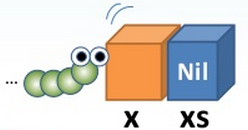
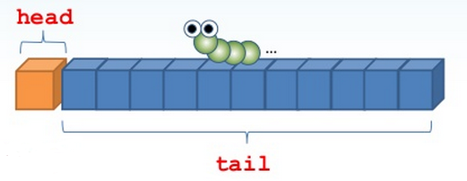

# 關於 Java Lambda Tutorial

相對於 JavaScript、Python、Scala 等本身支援一級函式（First class function）的語言，Java 開發者對於一級函式是比較陌生的，因而在 2010 年 JCD 中的議程 [Lambda/Closure - 從 JavaScript、Python、Scala 到 Java SE 7](http://www.slideshare.net/JustinSDK/lambdaclosure-javascriptpythonscala-java-se-7 "Lambda/Closure - 從 JavaScript、Python、Scala 到 Java SE 7")，我簡單地從 JavaScript、Python、Scala 等語言的一級函式特性開始介紹，分享了 Java 要加入 Lambda/Closure 會有什麼樣的考量。

Java 的 Lambda 語法後來歷經了數次的討論與改變，後來確定在 Java SE 8 中引入 Lambda，也引進了因應新語法而帶來的 API 新功能，因而我在 2012 年 Java TWO 議程 [Java SE 8 的 Lambda 連鎖反應](http://www.slideshare.net/JustinSDK/java-se-8-lambda "Java SE 8 的 Lambda 連鎖反應") 中，從 Lambda 演算開始探討了 Lambda 的前世今生，以及會對 Java 帶來的新典範（Paradigm）與風格。

Java 引入的新典範其實有著函數式程式設計（Functional programming）的影子，想要善用 Java 引入的 Lambda 語法與新 API，先認識函數式程式設計會有非常大的幫助，因而在 2012 年 JCD 中，我於議程 [Java 開發者的函數式程式設計](http://www.slideshare.net/JustinSDK/java-16416534 "Java 開發者的函數式程式設計") 中探討了函數式程式設計，以及在 Java 中如何適當地運用函數式風格。

Java SE 8 確定於 2014 年 3 月發表，而我發現過去的這幾個議程可以整理成為系列文章，讓大家可以認識 Java 中 Lambda 的前世今生。除此之外，最後並加上了 JDK8 Functional API 的介紹，讓本書對 JDK8 Lambda 的介紹更為完整。

----------
----------

# 認識 Lambda/Closure

根據維基百科對 [Lambda](http://en.wikipedia.org/wiki/Lambda "Lambda") 條目的說明：「在諸如 Lisp、Python 的語言中，Lambda 是代表匿名函數（Anonymous）或閉包（Closure）的運算子。」

JDK8 中即將支援 Lambda 語法，那麼 Lambda 是什麼？該怎麼用？Lambda/Closure 在 Java 語言中一直不存在，因而對於 Java 開發者來說是陌生的。實際上，Lambda/Closure 早存在許多程式語言之中，對於尚不熟悉 Lambda/Closure 的 Java 開發者來說，可試著從其他具備 Lambda/Closure 的語言中，瞭解其概念及運用方式。

## 從 JavaScript 的函式物件談起

以現今許多開發者較熟悉的 JavaScript 為例。在 JavaScript 中可以如下定義函式：

```javascript
function doSome(param) ｛
    // 作些事
}
```

然而實際上在 JavaScript 中，函式是個物件，也可以如下建立一個函式物件，並指定給 ```doSome``` 變數：

```javascript
var doSome = function(param)｛
    // 作些事
};
```

等號右邊的部份在 JavaScript 中稱為一個函式實字（Function literal），它會建立一個 `Function` 的實例。你也可以不將函式物件指定給變數，這就形式了一個匿名函式：

```javascript
function(param) {
    // 作些事
};
```

如果不考慮一些細節差異性，上面的函式實字建立的函式實例，相當於使用 `new Function('param', '函式本體')`。這強調了函式本身是個物件，也就是個值的概念。既然函式是物件，那麼可以作什麼？它可以指定給別的變數：

```javascript
function foo(param) {
    document.write(param, '<br>');
}
var zzz = foo;
zzz('demo');
```

上面這個程式片段跟以下是相同的（精確地說，是類似的）：

```javascript
var foo = function(param) {
    document.write(param, '<br>');
};
var zzz = foo;
zzz('demo');
```

既然可以指定給別的變數，就可以作為引數傳入函式中：

```javascript
function show(element) {
    document.write(element, '<br>');
}
[1, 2, 3, 4, 5].forEach(show);
```

上面這個程式片段與以下是相同的（或說是類似的）：

```javascript
var show = function(element) {
    document.write(element, '<br>');
};
[1, 2, 3, 4, 5].forEach(show);
```

瞭解一個程式語言的概念時，不僅是從語法來學習，更要從它的文化與風格來深入。舉例而言，如果你只是用 Java 的慣例，來寫 JavaScript 的陣列元素走訪的話，可能會寫出以下風格的程式碼：

```javascript
var array = [1, 2, 3, 4, 5];
for(var i = 0; i < array.length; i++) {
    document.write(array[i] + '<br>');
}
```

然而如果以 JavaScript 的慣例與風格來寫，可以如下走訪陣列元素：

```javascript
[1, 2, 3, 4, 5].forEach(function(element) {
    document.write(element + '<br>');
});
```

從語言的文化、慣例與風格來瞭解與運用語法元素，你就可以更清楚地瞭解，像 Lambda/Closure 這類元素，該運用在何種場合。

既然函式可以作為引數傳入函式，那就可以設計回呼（Callback）函式。例如，如果你的瀏覽器或 JavaScript 客戶端沒有支援陣列的 `forEach` 函式，那可以自行設計：

```javascript
Array.prototype.forEach = function(callback) {
    for(var i = 0; i < this.length; i++) {
        callback(this[i]);
    }
};
 
[1, 2, 3, 4, 5].forEach(function(element) {
    document.write(element + '<br>');
});
```

從以上可知，當函式是物件，你就可以…

* 根據需要將之傳遞給另一個變數參考。
* 函式不再只能被呼叫，而可以主動傳遞給別的函式進行動作。
* 流程中不同的演算需求，可以設計回呼函式來抽換。

也就是，當函式是物件時，不但可以簡化語法，還可以有更多不同的設計方式，開放各種程式設計的可能性。

以上我們從 JavaScript 認識了匿名函式、函式是物件的概念，至於它為什麼叫 Lambda，這要到比較後面才會提到。接下來，我們會先從什麼是 Closure 開始認識。

## 什麼是 Closure？

簡化來說，Closure 是擁有閒置變數（Free variable）的運算式。閒置變數真正扮演的角色依當時參考的語彙環境（Lexical environment）而定。支援閉包的程式語言通常具有一級函式（First-class function）。建立函式不等於建立閉包。如果函式的閒置變數與當時語彙環境綁定，該函式才稱為閉包。

那麼何為閒置變數？閒置變數是指對於函式而言，既非區域變數也非參數的變數，像區域變數或參數，其作用範圍基本上在被定義的函式範圍中。它是被綁定變數（Bound variable）。

有沒有白話一點的寫法？唔！…就是…


舉個例子來說：

```javascript
function init() {
    var local = 10;
    setInterval(function() {
        alert(new Date() + ': ' + local);
    }, 3000);
}
window.onload = init;
```

以上程式片段中，單看粗體字部份，`local` 並沒有意義，對粗體字的匿名函式來說，`local` 是個閒置變數，然而該匿名函式的外圍函式（enclosing function）宣告了 `local` 區域變數，因而粗體字匿名函式綁定了外圍函式的 `local` 區域變數。

區域變數理應在函式呼叫過後即失去其作用。在上例中，網頁資源載入完成後會呼叫向 `onload` 事件註冊的函式，呼叫過後，`local` 變數理應失去作用，然而因為傳遞給 `setInterval` 的匿名函式中的閒置變數 `local` 綁定了外圍函式 `local` 變數，因此 `local` 變數的生命週期被延續了，在傳給 `setInterval` 的匿名函式存在期間，`local` 變數也會一直存活。

這就好比 `local` 原本號稱要與 `init` 函式海枯石爛，現在卻跟著匿名函式跑了一樣…XD

那實際如何應用 Closure 呢？常見的應用之一，就是在 JavaScript 中模擬私用性（private）。我們知道，JavaScript 本身是基於原型的（Prototype-based）語言，對於熟悉基於類別的（Class-based）語言使用者，經常需要模擬類別，而對於類別私有成員封裝，JavaScript 並沒有像 Java 有 `private` 之類的關鍵字，此時可以使用 Closure 加以模擬。例如：

```javascript
function Account(bal) {
    var balance = bal;
    this.getBalance = function() {
        return balance;
    };
    this.deposit = function(money) {
        if(money > 0) {
            balance += money;
        }
    };
}
var account = new Account(1000);
account.deposit(500); // OK
account.getBalance(); // OK
account.balance = 1000; // Error
```

上例是個用來模擬類別的典型範例，最後一行是錯誤的，因為 `account` 物件上並沒有 `balance` 特性（Property）。如果暫時不考慮一些細節的話，上例在 `var account = new Account(1000);` 時，相當於：

```javascript
var account = {};
Account.call(accoount, 10000);
```

在我前一篇文章中談過，JavaScript 中，函式實際上是物件，因而也可以擁有方法。

JavaScript 中每個函式物件都會擁有 `call` 方法，第一個參數接受函式中 `this` 實際的參考物件，第二個參數為函式物件上定義的第一個參數。也就是說，對照前一個模擬 `Account` 類別的 `Account` 函式，`call` 呼叫 `Account` 函式的過程中，在 `this`，也就是 `call` 傳入的物件上新增了 `getBalance` 與 `deposit` 特性，分別參考至一個匿名函式，而這些匿名函式分別綁定了 `balance` 變數，也就是分別形成了 Closure。因此當你透過 `account` 物件的 `getBalance` 與 `deposit` 特性呼叫函式時，是可以存取 `balance` 變數的。

然而，`account` 物件上並沒有新增 `balance` 特性，`balance` 變數是 `Account` 函式的區域變數，因此無法直接存取，這就達成了私有性模擬的目的。

看來，`balance` 變數可以橫跨多個 Closure，所以若要用比擬的方式來說，就像是腳踏多條船吧！… XD

以上的討論，大概讓我們瞭解 Closure 的基本概念與作用，我不打算談太多 JavaScript 中閉包的應用，有興趣的話，可以參考 [JavaScript Essence: 閉包（Closure）](http://openhome.cc/Gossip/JavaScript/Closure.html "JavaScript Essence: 閉包（Closure）")。

我們將逐步討論不同語言中對一級函式與閉包的支援，逐步帶出 Java 中引入 Lambda 語法的考量點有哪些。接下來，會先來看看 Python 3 是如何支援一級函式與閉包。

## Python 對 Lambda/Closure 的支援

在 Python 中可以使用 `def` 定義函式。每個函式都是 `function` 的實例，所以可以指定給其他變數。例如：

```python
def max(m, n):
    return m if m > n else n
 
print(max(10, 3)) # print 10
 
maximum = max
print(maximum(10, 3)) # print 10**
```
如果要在 Python 中建立匿名函式，可以使用 `lambda` 運算式。例如：

```python
max = lambda m, n: m if m > n else n
print(max(10, 3)) # print 10
```

不同的語言在支援函式或 Lambda 時提供不同的語法。Python 簡明的語法顯然在表達函式上，優於 JavaScript。在以下的對比中，你可以明顯看出兩者在表達函式上的差異性：

```javascript
// JavaScript 定義函式 
function max(n, n) {
    return m > n ? m : n;
}
```

```python
# 定義函式 Python
def max(m, n):
    return m if m > n else n
```

```javascript
// JavaScript 建立匿名函式 
function(n, n) {
    return m > n ? m : n;
};
```

```python
# Python 建立匿名函式 
lambda m, n: m if m > n else n
```

來看看另一個運用 Lambda/Closure 的例子。如果你的函式運用了某個耗時的資源，通常可以考慮將運算的結果加以重用，這是效能調整上的一個考量。方法之一是建立全域資源，並在函式中加以運用。然而，全域資源不是個好的方式。我們可以在函式中準備資源，建立一個 Closure 捕捉他，然後從函式中傳回 Closure。例如：

```python
import math
def prepare_factor(max):
    # Creating a prime table is time-consuming.
    primes = [i for i in range(2, max) if prime[i] == 1]
 
    def factor(num):
        while primes[i] ** 2 <= num:
            if num % primes[i] == 0:
                list.append(primes[i])
                num //= primes[i]
            else:
                i += 1
 
    return factor
 
factor = prepare_factor(1000)
print(factor(100)) # print [2, 2, 5, 5]
```

在上例中，內部函式 `factor` 建立了 Closure 捕捉了外部函式的 `primes` 變數。因為函式是物件，你可以從函式中傳回它。`primes` 變數的生命週期現在跟隨著被傳回的函式。我們沒有將 `primes` 變數放在全域範圍，但仍可以重用資源。

到目前為止你可以看到，如果函式是物件，那麼就可以：

* 被任何變數參考。
* 不只是被動地被呼叫，還可以主動地傳入函式中，取代某個可重用流程模版中的演算法。
* 建立 Closure 捕捉閒置變數（Free variable）並從函式中傳回。

不過，Python 的 Closure 有個重大的限制。你沒辦法對閒置變數設值。也就是說，在 Python 中，Closure 捕捉的閒置變數是唯讀的。例如：

```python
def func():
    x = 10
    def getX():
        return x
    def setX(n):
        x = n   # 建立區域變數 x
    return (gegX, setX)
 
getX, setX = func()
getX() # 10
 
setX(20)
getX(10) # still 10
```

在 Python 中，首次對變數設值時就等同於建立新的區域變數。在上例中，如果呼叫 `setX`，事實上會在 `setX` 中建立區域變數 `x`，而不是將參數 `n` 指定給 `func` 的區域變數。這就是為何你最後會得到 10 的原因。

幸運地，在 Python 3 中，可以使用 `global` 或 `nonlocal` 關鍵字來明確指定變數的範圍，以避免這類情況。例如：

```python
def func():
    x = 10
    def getX():
        return x
    def setX(n):
        nonlocal x = n
    return (gegX, setX)
 
getX, setX = func()
getX() # 10
 
setX(20)
getX(10) # 20
```

在上例中，`nonlocal` 關鍵字表示 `x` 不會是區域變數。Python 直譯器會看看外部函式，並瞭解到 `x` 是從 `func` 的區域變數 `x` 捕捉而來。這次再呼叫 `setX`，改變的值確實就是 `func` 中區域變數 `x` 的值了。

我們已經看過 JavaScript 與 Python 對 Lambda/Closure 的支援方式。他們都是動態語言。如果使用的是靜態語言，那麼會有哪些要素需要考量？看看現有並且支援 Lambda/Closure 的靜態語言，從中瞭解一些經驗似乎是個不錯的方式。這也是接下來要看的內容，我們會來看看 Scala 如何支援 Lambda/Closure。

## 從 Scala 中借鏡

在先前的內容中，我們使用了 JavaScript 與 Python 來示範 Lambda/Closure 為何，以及如何善用它們。就學習 Lambda/Closure 而言，這是個不錯的開始，因為 JavaScript 與 Python 都是動態語言，在這些語言中不用在意變數的型態。

然而在步入靜態語言的世界時，我們都知道編譯器需要型態訊息，以便在編譯時期檢查出各種可能的型態不符之錯誤。這點很有助益，因為可以在撰寫程式的一開始就捕捉到一些錯誤，降低因錯誤而帶來的成本負擔。不過在討論到程式碼的簡潔度時，靜態語言中冗長的型態宣告常是令人詬病的對象。

先來看看 Scala 中如何定義函式好了：

```scala
def max(m: Int, n: Int): Int = if(m > n) m else n
```

Scala 是靜態語言，所以必須宣告函式的參數型態為何。在這邊型態宣告似乎沒什麼大問題。嗯…來看看如何宣告匿名函式並指定給變數好了。

```scala
val max: (Int, Int) => Int = (m: Int, n: Int) => if(m > n) m else n
```

喔…看來語法一大垞！你必須聲明 `max` 的型態為 `(Int, Int) => Int`，這專用的函式型態表示，此函式會接受兩個 `Int` 引數，而傳回值是 `Int`。在定義匿名函式本身時，也必須宣告參數的型態，像是 `(m: Int, n: Int) => if(m > n) m else n`。如果要定義一個可接受回呼函式的參數，也必須宣告該參數的函式型態。例如：

```scala
def bubbleSort(arr: Array[Int], order: (Int, Int) => Boolean): Unit {
    ...
    val o: Boolean = order(a, b)
    ...
}
```

上例中，`order` 參數接受一個函式，該函式會有兩個 `Int` 參數，並傳回 `Boolean` 值。以下的程式碼示範了如何呼叫 `bubbleSort` 函式。

```scala
val arr: Array[Int] = Array(2, 5, 1, 7, 8)
bubbleSort(arr, (a: Int, b: Int) => a > b)
```

如果在 Scala 中真的得用這麼冗長的語法，你還會想用 Lambda/Closure 嗎？所幸地是，Scala 的編譯器很聰明，能夠進行型態推斷（Type inference）。它能夠從原始碼前後文推斷出型態資訊，所以實際上在宣告變數或撰寫匿名函式時，有很大的機會是不用宣告型態的。例如，實際上先前的程式碼可以重新撰寫為以下的形式：

```scala
val arr = Array(2, 5, 1, 7, 8)
bubbleSort(arr, (a, b) => a > b)
```

在上例中，Scala 編譯器從 `Array(2, 5, 1, 7, 8) `的程式碼中推斷出 arr 的型態會是 `Array[Int]`，所以你就不用作宣告了。而且，Scala 編譯器可以從 `arr` 推斷，匿名函式將接受的引數型態會是 `Int`，所以實際上你只要提供參數名稱及函式本體就可以了。事實上在 Scala 中，你還可以用更短的語法來呼叫該函式。例如：

```scala
val arr = Array(2, 5, 1, 7, 8)
bubbleSort(arr, (_: Int) > (_: Int))
```

或者，甚至是以下最短的語法：

在這邊不打算解釋 Scala 是如何完成這類的魔法，如果有興趣瞭解的話，可以進一步看看 [Scala 學習筆記](http://openhome.cc/Gossip/Scala/ "Scala 學習筆記")。

這邊的重點在於，對於靜態語言來說，類型推斷是很重要的功能。在必須提供型態資訊的場合中，類型推斷可以讓程式碼簡潔易讀，像是在宣告變數或者是撰寫匿名函式的時候。Lambda/Closure 是個表達工具，如果沒有型態推斷，過於冗長的語法只會讓開發者望之卻步，不可能讓他們有意願採用。

接下來就會來談談 Java 中的 Lambda/Closure。不過，實際上會先來看個 [舊提案](http://cr.openjdk.java.net/~mr/lambda/straw-man/ "舊提案")，這有助於我們瞭解 Lambda/Closure 何以會演變為現今 JDK8 中的形態。

## Java 的稻草人提案

終於要開始討論 Java 的 Lambda/Closure 了！不過這邊會先討論 2009 年提出的 [舊草案](http://cr.openjdk.java.net/~mr/lambda/straw-man/ "舊草案")，討論這份舊草案，有助於我們瞭解為什麼 Lambda/Closure 會演變至今天 JDK8 所採取的形式。

如果打算對一列整數排序，在 JDK8 之前，你也許會寫下以下的程式碼：

```java
// asList 與 sort 方法是從 Arrays 與 Collections 中 static import 而來
List<Integer> numbers = asList(3, 2, 6, 4);
sort(numbers, new Comparator<Integer>() {
    public int compare(Integer n1, Integer n2) {
        return -n1.compareTo(n2);
    }
});
```

你必須告訴 `sort` 方法兩個數字的順序為何。JDK8 之前的 Java 因為沒有一級函式，所以範例使用了匿名類別來建立了 `Comparator` 實例，不過冗長的語法，讓開發者較難一眼就看出打算令 `sort` 方法做些什麼。如果使用個適當的變數名稱，會讓可讀性好一些。例如：

```java
List<Integer> numbers = asList(3, 2, 6, 4);
 
Comparator<Integer> descending = new Comparator<Integer>() {
    public int compare(Integer n1, Integer n2) {
        return -n1.compareTo(n2);
    }
};
 
sort(numbers, descending);
```

現在，我們可以清楚地看出打算令 `sort` 方法做些什麼，不過使用匿名類別還是有點煩人。如果能使用 JDK8 採用的 Lambda/Closure 語法的話，程式碼可以更短更簡潔。例如：

```java
List<Integer> numbers = asList(3, 2, 6, 4);
sort(numbers, (n1, n2) -> -n1.compareTo(n2));
```

在 Java 中，匿名類別是最類似 Lambda/Closure 的東西，這也是有些人聲稱 Java 其實不需要 Lambda/Closure 的原因。基本上，這沒有錯，只是在某些場合中，我們得寫比較多的程式碼罷了。近幾年來，撰寫簡明程式碼越來越被重視。雖然使用沒有 Lambda/Closure 的 Java，還是可以寫出你想要的功能，使用 Lambda/Closure 卻可以寫出簡潔的程式碼，你或其他人在讀取這樣的程式碼時會有助於產能。就如同 Bob Martin 大叔在 《Clean Code》 書中談到的：

> 今日你撰寫程式碼的難易度，取決於其周遭程式碼閱讀時的難易度。

匿名類別冗長的語法不是唯一的問題。如果匿名類別打算捕捉區域變數的話，該變數必須被宣告為 `final`。例如：

```java
public static FactorProducer createFactorProducer(max) {
final int[] primes = ...;
FactorProducer producer = new FactorProducer() {
        public int factor() {
            ...
            while(pow(primes[i], 2)) {
                ...
            }
        }
    };
    return producer;
}
```

在 Java 中，區域變數的生命週期有別於物件。一旦方法執行完畢，所有區域變數的生命週期也就結束了。如果匿名類別的實例能確實捕捉區域變數，並從方法中傳回，當你透過該實例存取到已結束生命週期的區域變數時會如何？為了避免這類問題，如果區域變數會在匿名類別中使用的話，Java 編譯器強迫你要在區域變數上加上 `final` 加以修飾。被捕捉的變數（而不是它參考的物件）就會是唯讀的。實際在底層中，Java 編譯器會建立在匿名類別中建立新的變數，將原本 `final` 變數的參考複製給新變數。你並非真的捕捉了外部的區域變數，你只是有一個新變數並被複製的參考值。

匿名類別中的 `final` 有什麼問題？或者說，Closure 中只能唯讀的變數有什麼問題？這個問題的答案取決於你打算用 Closure 做些什麼？在先前 〈什麼是 Closure？〉 中，我們看過 Closure 在 JavaScript 中可用來模擬 `private` 特性，在這種情況下，可寫的閒置變數（Free varialbe）是必要的。不過可寫的閒置變數基本上暗示著，執行流程會是循序的（Serial）。像是這段 JavaScript：

```javascript
var sum = 0;
[1, 2, 3, 4, 5].forEach(function(elem) {
    sum += elem;
});
```

可設值的閒置變數也代表著狀態是可變的（Mutable），在並行（Concurrent）程式設計時就得處理鎖定（Locking）問題。為了避免處理複雜的變數生命週期以及並行問題，之後我們將看到的，JDK8 特意禁止捕捉可變的區域變數。

在 2009 年的一份草案中，要定義 Lambda，以及要宣告一個可接受 Lambda 的變數，會是像這樣：

```java
#int(int) doubler = #(int x)(2 * x);
doubler.(3) // 呼叫 Lambda
```

以上範例作用上類似於以下：

```java
int doubler(int x) {
    return 2 * x;
}
doubler(3);
```

具備兩個 `int` 參數並傳回 `int` 值的 Lambda 可以如下定義：

```java
#int(int, int) sum = #(int x, int y)(x + y)
```

以上程式碼在作用上類似於以下：

```java
int sum(int x, int y) {
    return x + y;
}
```

如果要用這個語法來寫一下 〈從 Scala 中借鏡〉  中的 `bubbleSort` 函式，大概會像是：

```java
void bubbleSort(int[] arr, #boolean(int, int) order) {
    ...
    boolean o = order.(a, b);
    ...
}
int[] arr = new int[] {2, 5, 1, 7, 8};
bubbleSort(arr, #(int a, int b)(a > b));
```

這邊的重點在於，舊草案要求接受 Lambda 的變數，必須宣告函式型態。可以看出宣告函式型態的語法中，傳回值型態是放在左邊，然而定義 Lambda 時，函式本體是放在右邊。來思考一個問題，如果你有個 Lambda 會傳回 Lambda，那麼函式型態宣告會長什麼樣子？

```java
##int(int)(int) sum = #(int x)(#(int y)(x + y));
```

哇喔 … 這是 C/C++ 的指標嗎？另一個問題在於，如果必須為了 Lambda/Closure 而宣告函式型態，那麼就得為 Lambda/Closure 建立一套新的 API。現有的 API 沒辦法直接受惠於新引入的 Lambda/Closure，更何況，還得解決涉及到泛型時的複雜問題。

幸運地，JDK8 沒有採取這種特定函式型態的語法，它使用單一抽象方法（Single abstract method）型態，也就是之後被稱為函式介面（Functional interface）的方式，而這是之後將要探討的內容。

## 一級函式與 Lambda 演算

值可以指定給變數。一級值（first-class value）可以傳入函式或由函式中傳回。在多數程式語言中，基本型態或物件是一級值，那麼函式或運算式呢（expression）？

在一些語言中，函式是一等公民（first-class citizen）（或者稱為高階函式）。例如，在 認識 Lambda/Closure（1）中我們看過，JavaScript 的函式是物件，也就是說，它們是一級值，可以指定給變數、傳入函式或從函式中傳回。

不過，為什麼一級函式也稱為 Lambda？在回答這個問題之前，我們必須認識一下 Lambda 演算（也可以寫成 λ 演算）。簡單地說，在 λ 演算中，函式是僅帶一個參數的運算式。參數也可以接受帶有一個參數的函式。λ 演算中的函式是匿名的。例如，若將數學函數 `f(x) = x * 2 `以匿名函式撰寫的話會是：

```
λ x. x * 2
```

如果採用 JDK8 最後採用的語法，則可以寫為：

```
x -> x * 2
```

也就是說，Lambda 運算式會將 `x` 映射為 `x * 2`。如果要把 2 套用到 `x`，則套用的過程會是：

```
(x -> x * 2)(2)
= 2 * 2
= 4
```

如果有個函數 `g(y) = y - 1`，並且想將 `f(x) = x * 2` 套用到 `y`，那麼可如下得到新函數 `h(x) = g(f(x))`：

```
h(x)
= g(f(x))
= f(x) - 1
= x * 2 - 1
```

使用 Lambda 運算式將上面套用過程重新寫過的話，就會得到新的 Lambda 運算式。

```
(y -> y - 1)(x -> x * 2)
= x -> x * 2 - 1
```

在 λ 演算中，函式是運算式，也稱為 Lambda 函式，它是僅帶一個參數的函式。那麼，如何表示數學上具備兩個輸入的函數呢？

來想看看 `f(x, y) = x * x + y * y` 這個函數。如果 `a` 套用至 `x`，就會得到新函數 `f(a, y) = a * a + y * y`。可以令 `g(y) = f(a, y) = a * a + y * y`。將 `b` 套用至 `y` 會得到 `g(b) = a * a + b * b = f(a, b)`。

也就是說，需要兩個輸入的函數，可以用接受單一輸入的函數，令其傳回另一接受單一輸入的函數來重新打造。如果用匿名形式來撰寫 `f(x, y) = x * x + y * y`，則會是如下的形式：

```
(x, y) -> x * x + y * y
= x -> (y -> x * x + y * y)
```

將 `a` 套用至 `x`，接著將 `b` 套用至 `y` 的話，則會是：

```
(x -> (y -> x * x + y * y))(a)(b)
= (y -> a * a + y * y)(b)
= a * a + b * b
```

在 λ 演算中，任何超過一個參數以上的函式，可以由數個單參數的函式依序套用而得。我們也可以使用 Lambda 演算來實作控制流程函式，像是 `if`、`forEach` 之類的。基本上，可以用 Lambda 演算式來實作一個小型通用式語言。例如，可以如下實作 `not`、`and`、`or`：

```
let not =
* false -> true
* true -> false
 
let and =
* false value -> false
* true value -> value
* value false -> false
* value true -> value
 
let or =
* false value -> value
* true value -> true
* value false -> value
* value true -> true

let if = cond -> tv -> fv -> (cond and tv) or (not cond and fv)
```

上面的 `if` 函式就像是一些語言中的 `if` 運算式，如果 `cond` 是 `true`，則會傳回第一個 `tv`。例如：

```
if(true)(a)(b)
= ((cond or fv) and (cond and tv))(true)(a)(b)
=((true and tv) or (not true and fv))(a)(b)
=((true and a) or (not true and fv))(b)
=(true and a) or (not true and b)
= a or (false and b)
= a or false
= a
```

我們也可以實作一個 `unless` 函式。

```
let unless = cond -> fv -> tv -> (cond or fv) and (cond and tv)
```

`unless` 函式在 `cond` 為 `true` 時會傳回第二個 `tv`。例如：

```
unless(true)(a)(b)
= ((cond or fv) and (cond and tv))(true)(a)(b)
= ((true or fv) and (true and tv))(a)(b)
= ((true or a) and (true and tv))(b)
= (true or a) and (true and b)
= true and b
= b
```

不同的語言會提供不同的語法來支援 Lambda 運算式。例如，用 JavaScript 來表達 `(x -> x * 2)` 的話，可以寫成以下形式：

```javascript
function(<strong>x</strong>) {
    return x * 2;
};
```

這個語法看起來有點囉嗦。基本上，我們關心的只是 `x` 會被映射為 `x * 2`。也許我們不該太過挑剔，至少 JavaScript 直接提供了一級函式的特性，而且它是個動態語言。如果使用不支援一級函式的靜態語言的話，像是 Java，那會發生什麼事？

我們曾經看過，在 Java 中最接近 Lambda 函式的東西是匿名類別。如果想用它來表達 `(x -> x * 2)` 的話該怎麼做呢？首先，具有一個參數與傳回值的函式，我們使用具有單一抽象方法的介面來定義。

```java
public interface Func<P, R> {
    R apply(P p);
}
```

接著，可以使用匿名類別來實作 `(x -> x * 2)`，如下：

```java
new Func<Integer, Integer>() {
    public Integer apply(Integer x) {
        return x * 2;
    }
};
```

哇喔！好大一垞！匿名類別的語法已經夠惱人了，我們甚至還得宣告型態，因為 Java 是靜態語言。如果我們打算進行函式合成的話，像是 `f(g(x))`，可以如下撰寫個 `compose` 方法：

```java
public static <A, B, C> Func<A, C> compose(final Func<A, B> f, final Func<B, C> g) {
    return new Func<A, C>() {
        public C apply(A, x) {
            return g.apply(f.apply(x));
        }
    };
}
```

你能一眼看出我們打算做什麼嗎？基本上，我們真正需要的只是 `g.apply(f.apply(x))`，不過匿名類別的語法讓我們失焦了。如果打算使用 `compose` 方法來做函式合成 `g(f(x))`，而其中 `f(x) = x + 2` 且 `g(y) = y * 3`，那麼就必須如下撰寫程式碼：

```java
compose(
    new Func<Integer, Integer>() {
        public Integer apply(Integer x) {
            return x + 2;
        }
    },
    new Func<Integer, Integer>() {
        public Integer apply(Integer y) {
            return y * 3;
        }
    }
);
```

正如在 〈Java 的稻草人提案〉 中談過的，有關 Java 需不需要 Lambda/Closure 的爭論是對，只是相對的代價是，撰寫更多的程式碼。有時候，也許是在多數情況下，我們很難看出程式碼到底想表達什麼，即使只是做個如上 `g(f(x))` 這樣簡單的函式合成也是如此。

使用 JDK8 中帶來的 Lambda 新特性，就能解決這些問題嗎？這就是接下來所要探討的了。

## JDK8 Lambda 語法

終於要來介紹 JDK8 Lambda 語法了。在 JDK8 中要表示 `(x -> x * 2)`，基本上，可以寫為以下的形式：

```java
(Integer x) -> x + 2
```

別忘了，Java 是靜態定型語言，所以在這邊型態宣告是必要的。在 〈從 Scala 中借鏡〉 中我們談過，對靜態定型語言來說，類型推斷（Type inference）對採用 Lambda/Closure 時是很重要的特性。當然，JDK8 必然得提供更強的類型推斷，如此在某些場合中，就可以省略型態宣告。先別急，本文介紹才剛開始。即便如此，以上的語法比起 〈一級函式與 Lambda 演算〉 中的匿名類別來說，語法上還是簡潔許多了。

有了 JDK8 Lambda，要寫個 `compose` 方法來做函數合成，就可以如下撰寫：

```java
public static <A, B, C> Func<A, C> compose(Func<A, B> f, Func<B, C> g) {
    return x -> g.apply(f.apply(x));
}
```

我們仍然需要 〈一級函式與 Lambda 演算〉 中定義的 `Func` 介面，然而函數本體的實作清楚多了。如果你不看 `.apply` 的部份，`x -> g.apply(f.apply(x))` 就會是 `x -> g(f(x))`，可清楚地表達出我們的意圖。使用 `compose` 來做函數合成 `g(f(x))`，其中 `f(x) = x + 2` 與 `g(y) = y * 3` 的話，則可以寫為：

```java
compose((Integer x) -> x + 2, (Integer y) -> y * 3);
```

以下再次列出 〈一級函式與 Lambda 演算〉 中使用匿名類別的寫法，比較一下兩個程式碼，你會選擇使用哪個呢？

```java
compose(
    new Func<Integer, Integer>() {
        public Integer apply(Integer x) {
            return x + 2;
        }
    },
    new Func<Integer, Integer>() {
        public Integer apply(Integer y) {
            return y * 3;
        }
    }
);
```

JDK8 Lambda 的通用語法是由參數列、箭號 token `->` 與函式本體組成。以下是 Lambda 表示式的兩個例子：

```java
// 計算 x 與 y 的和
(int x, int y) -> x + y
 
// 不帶引數，直接傳回整數 42
() -> 42
```

在 JDK8 Lambda 中，本體可以是單一運算式或者是陳述區塊。例如：

```java
// 取得字串並輸出至主控台，沒有傳回值
(String s) -> { out.println(s); }
 
// 取一個整數並傳回一個整數
(Integer x) -> {
    Integer result;
    ...other statements
    ...
    return result;
};
```

區塊可以由數個陳述句組成，不過基本上不建議如此使用。在運用 Lambda 時，儘量使用簡單的運算式會是比較好的。如果你的實作比較複雜，還有其他方式可以運用到 JDK8 Lambda 的好處，之後就會介紹到。

在一些語言中，Lambda 表示式本身就具備型態，像是 JavaScript 中匿名函式會是 `Function` 的實例。在 JDK8 中，Lambda 表示式（或陳述句）本身是中性的。如果沒有目標型態（Target type），Lambda 表示式不代表任何一種物件。如何定義 Lambda 表示式的目標型態呢？Java 並不是天生就具備一級函式的語言。在 〈Java 的稻草人提案〉 中我們看過，避免增加一個複雜的型態系統，以及保持與過往 API 的相容性，是 Java 中採用 Lambda 時的兩個重要目標。JDK8 並沒有導入新的函式型態，而是定義函式介面（Functional interface）作為 Lambda 表示式的代表型態。函式介面是僅具單一抽象方法的介面，許多現存的介面都是這種介面，像是 `Runnable`、`Callable`、`Comparator` 等。

```java
public interface Runnable {
    void run();
}
 
public interface Callable<V> {
    V call() throws Exception;
}
 
public interface Comparator<T> {
    int compare(T o1, T o2);
}
```

在 〈一級函式與 Lambda 演算〉 中定義的 `Func` 介面也是函式介面。Lambda 表示式的目標型態，會從對應的函式介面推斷而來。例如，以下的 Lambda 運算式會是 `Func` 的實例：

```java
Func<Integer, Integer> func = x -> x * 2;
```

在這邊型態推斷發揮了作用，參數 `x` 以及傳回值的型態而從泛型宣告與方法簽署（Method signature）推斷而來，所以在上面的 Lambda 表示式中不需要宣告型態。如果有個函式介面定義如下：

```java
public interface Function<P, R> {
    R call(P p);
}
```

在以下的範例中，同樣是 `(x -> x * 2)` 這個表示式，實際上會成為 `Function` 的實例，參數與傳回值型態則都會是 `Double`。

```java
Function<Double, Double> f2 = x -> x * 2;
```

所以，Lambda 表示式本身是中性的，它本身無關乎函式介面的名稱，它只關心方法簽署，但忽略方法名稱。

函式介面是僅具單一抽象方法的介面，不過有時候會難以直接看出介面是否為函式介面。例如，介面可能有預設方法（JDK8 的新特性）、可能繼承其他介面、重新定義了某些方法等，這些都會使得確認介面是否為函式介面更為困難。有個新的標註 `@FunctionalInterface` 被引入，它可以這麼使用：

```java
@FunctionalInterface
public interface Func<P, R> {
    R apply(P p);
}
```

如果介面使用了 `@FunctinalInterface` 來標註，而本身並非函式介面的話，就會引發編譯錯誤。例如：

```java
@FunctionalInterface
public interface Function<P, R> {
    R call(P p);
    R call(P p1, P p2);
}
```

編譯器會對此介面產生以下編譯錯誤：

    @FunctionalInterface
     ^
     Function is not a functional interface
     multiple non-overriding abstract methods found in interface Function

看來，Lambda 語法不過就是匿名類別的編譯器語法蜜糖嘛！真的嗎？來看一下接下來的程式，想想看結果會如何顯示？

```java
import static java.lang.System.out;
 
public class Hello {
    Runnable r1 = new Runnable() {
        public void run() {
            out.println(this);
        }
    };
    Runnable r2 = new Runnable() {
        public void run() {
            out.println(toString());
        }
    };
 
    public String toString() { return "Hello, world!"; }
 
    public static void main(String[] args) {
        new Hello().r1.run();
        new Hello().r2.run();
    }
}
```

結果會顯示像是 Hello$1@103368e 與 Hello$2@1f2ae62，這是因為 `this` 以及 `toString` 代表的對象，實際上會來自匿名類別對應的實例。再來看看接下來的程式，它會顯示什麼？

```java
import static java.lang.System.out;
 
public class Hello {
    Runnable r1 = () -> { out.println(this); };
    Runnable r2 = () -> { out.println(toString()); };
 
    public String toString() { return "Hello, world!"; }
 
    public static void main(String[] args) {
        new Hello().r1.run();
        new Hello().r2.run();
    }
}
```

結果會顯示兩次的 “Hello, world!"，也就是說，Lambda 表示式本體中的 `this` 與 `toString` 實際參考對象，是來自當時包含它們的環境，也就是 `Hello` 實例。也注意到，先前定義的 `compose` 方法中，參數列上並不需要 `final` 關鍵字。

在 〈Java 的稻草人提案〉 中我們看過，如果要在匿名類別中使用外在的區域變數，Java 的編譯器會強制你在區塊變數加上 `final`，即使變數實際上於匿名類別中並不會做任何修改。JDK8 放寬了這個限制，如果變數本身等效於 `final` 區域變數，也就是說，如果變數不會在 Lambda 表示式中有重新指定的動作，就可以不用加上 `final` 關鍵字。

不過，我們可以在 Lambda 表示式中改變被捕捉的變數值嗎？像是在 JavaScript 或 Scala 中可以做到的事情？因為可重新指定的閒置變數（Free variable）也代表著可變的狀態，而可變狀態代表著在並行程式設計（JDK8 會想要採用 Lambda 的理由之一）會有鎖定問題，JDK8 特意禁止你捕捉可變動的區域變數。你無法在 Lambda 表示式中改變被捕捉的變數值。

你已經看過 JDK8 Lambda 的基本語法了，如你到目前看到的，與現有 API 保持相容性也是 Java 中採用 Lambda 的目標之一。Java 是一門古老且具有一大堆 API 的語言，它會採用什麼策略來解決這個問題？這是接下來要討論的內容。

## 方法參考與建構式參考

根據名稱的長度進行排序，可以如下撰寫程式：

```java
List<String> names = Arrays.asList("Justin", "Monica", "Irene", "caterpillar");
Collections.sort(names, new Comparator<String>() {
    public int compare(String s1, String s2) {
        return s1.length() - s2.length();
    }
});
```

如果你單只是看 `compare` 的方法本體實作，並不容易看出程式碼要做些什麼。你也許還會有其他的排序策略，因此，你在 `StringOrder` 類別中，定義了幾個 `static` 方法：

```java
public class StringOrder {
    public static int byLength(String s1, String s2) {
        return s1.length() - s2.length();
    }
 
    public static int byLexicography(String s1, String s2) {
        return s1.compareTo(s2);
    }
 
    public static int byLexicographyIgnoreCase(String s1, String s2) {
        return s1.compareToIgnoreCase(s2);
    }
    ...
}
```

現在，你可以將先前的程式碼改寫為以下：

```java
Collections.sort(names, new Comparator<String>() {
    public int compare(String s1, String s2) {
        return StringOrder.byLength(s1, s2);
    }
});
```

程式打算做些什麼，現在看來是清楚多了。使用 JDK8 Lambda 的話，可以讓這個程式碼變得更清楚些。

```java
Collections.sort(names, (s1, s2) -> StringOrder.byLength(s1, s2));
```

也許有個聰明的傢伙發現了，除了方法名稱之外，`byLength` 方法的簽署與 `Comparator` 的 `compare` 方法相同。我們知道，Lambda 運算式是匿名方法（函式），而 Lambda 運算式的本體部份就是函式介面（Functional interface）的方法實作。因為我們只是把參數 `s1` 與 `s2` 傳給 `byLength` 方法，那麼可以直接重用 `byLength` 方法的實作不是更好嗎？是的，JDK8 提供了方法可參考的特性，可以達到這個目的：

```java
Collections.sort(names, StringOrder::byLength);
```

在 Java 中引人 Lambda 的同時，與現有 API 維持相容性是主要考量之一。除了採用函式介面之外，方法參數（Method reference）在重用現有 API 上也扮演了重要的角色。重用現有的方法實作，可避免到處寫下 Lambda 運算式。上面的例子是運用了方法參考中的一種形式 – 參考了 `static `方法。你也可以參考至特定型態的任意物件之實例方法。例如，按照字典順序對名稱清單進行排序，原本可以如下撰寫：

```java
Collections.sort(names, StringOrder::byLexicography);
```

從先前的段落說明中，我們知道 `StringOrder::byLexicography` 會參考到 `byLexicography` 方法實作，而以下的程式碼也有相同的排序效果：

```java
Collections.sort(names, (s1, s2) -> s1.compareTo(s2));
```

我們可以發現到，在 Lambda 運算式的本體部份，第一個參數 `s1` 會是 `compareTo` 的接受者，而第二個參數 `s2` 則是 `compareTo` 方法的引數，在這種情況下，其實我們可以直接參考 `String` 類別的 `compareTo` 方法，像是：

```java
Collections.sort(names, String::compareTo);
```

類似地，想對名稱清單按照字典順序排序，但忽略大小寫差異，本來可以如下參考 `static` 方法來達到：

```java
Collections.sort(names, StringOrder::byLexicographyIgnoreCase);
```

再次地，在 `byLexicographyIgnoreCase` 的方法實作中，第一個參數是 `compareToIgnoreCase` 方法的接受者，而第二個參數是 `compareToIgnoreCase` 方法的引數，此時，我們可以直接參考 `String` 類別的 `compareToIgnoreCase` 方法。

```java
Collections.sort(names, String::compareToIgnoreCase);
```

可輕易觀察到，方法參考不僅避免了重複撰寫 Lambda 運算式，也可以讓程式碼更為清楚。除了以下兩種方法參考形式外，我們還可以參考特定物件的實例方法。例如，假設你正在設計一個可以過濾職缺應徵者的軟體，而你有以下兩個類別：

```java
public class JobVacancy {
    ...
    public int bySeniority(JobApplicant ja1, JobApplicant ja2) {
        ...
    }
 
    public int byEducation(JobApplicant ja1, JobApplicant ja2) {
        ...
    }
    ...
}
```

```java
public class JobApplicant {
    ...
}
```

如果你使用 JDK8，並如下撰寫 Lambda 演算式來進行應徵者的排序：

```java
List<JobApplicant> applicants = ...;
JobVacancy vacancy = ...;
Collections.sort(applicants, (ja1, ja2) -> vacancy.bySeniority(ja1, ja2));
```

Lambda 運算式捕捉了 `vacancy` 參考的物件。`bySeniority` 方法的簽署與 `Comparator `的 `compare` 方法相同，此時，我們可以直接參考 `vacancy` 物件的 `bySeniority` 方法。

```java
Collections.sort(applicants, vacancy::bySeniority);
```

除了方法參考之外，JDK8 還提供了建構式參考（Constructor references）。你也許會發出疑問：「建構式？他們有傳回值型態嗎？」有的！其實每個建構式都會有傳回值型態 – 也就是定義它們的類別本身。例如，若你有以下的介面：

```java
public interface Part {
    ...
}
```

```java
public interface Material {
    ...
}
```

```java
public interface PartFactory {
    Part createPart(Material material);
}
```

你為這些介面撰寫了一些實作：

```java
public class PartImpl implements Part {
    public PartImpl(Material material) {
        ...
    }
}
```

```java
public class MaterialImpl implements Material {
    ...
}
```

```java
public PartFactoryImpl implements PartFactory {
    public Part createPart(Material material) {
        return new PartImpl(material);
    }
}
```

接著，你可能使用以下的程式碼來建立 `Part` 實例：

```java
PartFactory factory = new PartFactoryImpl();
Part part = factory.createPart(new MaterialImpl());
```

`createPart` 方法的實作中，只是使用建構式來建立了 `Part` 的實例。使用 JDK8 的話，你就不用特別花時間定義 `PartFactoryImpl` 類別，你可以直接參考 `PartImpl` 的建構式。

```java
PartFactory factory = PartImpl::new;
Part part = factory.createPart(new MaterialImpl());
```

如果某類別有多個建構式，就會使用函式介面的方法簽署來比對，找出對應的建構式進行呼叫。

「等一下！怎麼沒討論預設方法（Default method）？那不是 Lambda 專案的一部份嗎？」

是的，預設方法確實是 Lambda 專案的一部份，不過它與現存的 API 如何演化有關。預設方法解除了介面上的一些限制，讓 Java 介面在進行防禦式（Defensive）的 API 演化時容易一些，並為流程的重用開啟了更多可能性，不過，也帶入多重繼承上的一些複雜度。在討論如何將現在的 API 演化的時候，我們也許會看到一些函數式程式設計（Functional programming）的影子。這些會留到下一個篇章 〈函數式程式設計〉 中來討論。

----------
----------

# 函數式程式設計

在 〈認識 Lambda/Closure〉 中，我談到了什麼是 Lambda/Closure、不同程式語言的支援方式，以及為什麼 JDK8 採用了目前的 Lambda 語法。想要善用 Lambda，可以從其他已具備一級函式的語言中借鏡，實際上在這些語言中，許多一級函式的概念是直接或間接來自於函數式程式設計（Functional programming），更進一步地，函數式程式設計的模型是基於 Lambda 演算。若能一步步深入這些概念，就更能夠瞭解 Lambda/Closure 的實際應用場合。

## 初探函數式程式設計

在 〈一級函式與 Lambda 演算〉 中，曾經簡介過 Lambda 演算的基本概念，而接下來我會介紹何謂函數式程式設計，以及在 Java 中如何進行函數式程式設計。不過，為什麼要認識函數式程式設計？

在 [〈你的程式語言可以這樣做嗎？〉](http://local.joelonsoftware.com/wiki/%E4%BD%A0%E7%9A%84%E7%A8%8B%E5%BC%8F%E8%AA%9E%E8%A8%80%E5%8F%AF%E4%BB%A5%E9%80%99%E6%A8%A3%E5%81%9A%E5%97%8E%EF%BC%9F "〈你的程式語言可以這樣做嗎？〉")（[Can Your Programming Language Do This?](http://www.joelonsoftware.com/items/2006/08/01.html "Can Your Programming Language Do This?")）中，Joel Spolsky 說過：

> …有第一級函數的編程語言讓你找到更多抽象化的機會…

在《編程的領尖對話》（Coders at Work） 這本書中，Simon Peyton Jones 提到：

> …純函數式領域中學到的觀念與想法，可能給主流領域帶來資訊，帶來啟發…

在 《Java 開發者的函數式程式設計》（Functional Programming for Java Developers）這本書中，Dean Wampler 在第一章〈為何要函數式程式設計？〉（Why Function Programming?）列出了五個看法：

* 我想寫好並行程式（Concurrent program）
* 大部份程式只是在做資料處理問題（Data Management Problem）
* 函數式程式設計更模組化
* 工作上我要更有效率
* 函數式程式設計是返樸歸真

想瞭解這幾點在說些什麼，最好的方式就是親自進行函數式程式設計。

> **插播** 我故意模彷了 Joel Spolsky 的文章，寫了篇 [〈你的腦袋可以這樣想嗎？〉](http://www.javaworld.com.tw/roller/caterpillar/entry/can_your_brain_think_this "〈你的腦袋可以這樣想嗎？〉")，有興趣的可以參考看看。 

首先來看看，要怎麼取得費式數（Fibonacci number）。根據維基百科中對費式數列的定義：

> 在數學上，費波那西數列是以遞歸的方法來定義：
> 
> ```
 F0 = 0
 F1 = 1
 Fn = Fn-1 + Fn-2
 ```

在命令式程式設計（Imperative programming）中，你必須告訴電腦求解問題的每個步驟。例如，可以使用 Java 實作一個如下的 `static` 方法：

```java
static int fib(int n) {
    if(n == 0 || n == 1) {
        return n;
    }
    int a = 0;
    int b = 1;
    for(int i = 2; i <= n; i++) {
        int tmp = b;
        b = a + b;
        a = tmp;
    }
    return b;
}
```

在函數式程式設計中，只要定義問題就可以了。也就是說，以你使用的程式語言來宣告問題。例如，可以使用 Java 如下宣告問題：

```java
static int fib(int n) {
    if(n == 0 || n == 1) {
        return n;
    }
    return fib(n - 1) + fib(n - 2);
}
```

這個程式碼的可讀性比第一個好此，不過如果程式語言直接支援函數式程式設計的話，會有更好的可讀性。例如，使用 Haskell 來實作的話，程式碼看起來與費式數的數學定義就很像：

```haskell
fib 0 = 0
fib 1 = 1
fib n = fib (n - 1) + fib (n - 2)
```

不過，這個函式的效能不太好。因為每次呼叫都會再進行兩次自身呼叫，如此呼叫下去，遞迴呼叫次數會呈指數增長。

可以使用遞迴中的一個特定形式 – 尾遞迴（Tail recursion） – 來改寫這個函式。在尾端迴中，函式會直接呼叫自身，或者是在最後一個步驟進行回傳，因此在呼叫堆疊中增加一個堆疊框架（Stack frame）時會耗用較少的資源，例如，此時就不再需要記錄區域變數，因為必要的運算都已完成；從遞迴返回時，也只需回傳相同的值，更重要的是，函數式語言常允許尾遞迴消去（Tail recursion elimination），像是在編譯時期用迴圈來取代尾遞迴，或者在執行時期進行最佳化，藉以增進效能。使用尾遞迴來重寫先前函式的話，會像是：

```haskell
fib 0 = 0
fib 1 = 1
fib n = addPrevsRecusivelyUntilCounterIsN (fib 1) (fib 0) 2 n
 
addPrevsRecusivelyUntilCounterIsN prev1 prev2 counter n
    | counter == n = result
    | otherwise = addPrevsRecusivelyUntilCounterIsN result prev1 (counter + 1) n
    where result = prev1 + prev2
```

呃 … 尾遞迴可能會增加一些複雜性。效能與可讀性幾乎總是對立的，即便如此，至少函數式程式設計的基本原則還是存在的，我們還是在定義問題，只是定義變得比較囉嗦而已，只不過，使用函數式語言的話，可以有更多的機會在效能與可讀性之間找到平衡點。你也可以運用尾遞迴來改寫先前的 Java 方法，只不過，程式碼會更複雜，而且 Java 並不支援尾遞迴消去。

這邊的重點在於，如果使用的語言並非函數式語言，你不能不假思索地直接套用函數式設計的所有概念，否則就有可能事倍功半，可讀性與效能都會變差。如果你想進行純函數式程式設計，使用函數式語言會比較好，像是 Scala、Haskell 等。

那麼使用非函數式語言，要怎麼撰寫函數式風格的程式碼呢？只有先瞭解函數式設計的本質，才可以讓我們明瞭，如何適當地擷取函數式設計的概念。

函數式程式設計中一個顯而易見的外在形式就是遞迴，不過，遞迴不是重點，將問題分解為子問題才是重點，通常子問題在分解之後，自然而然就會形成遞迴。以加總數列為例，以命令式方式求解的話，就必須要求電腦將變數 `sum` 初始為 0，取得數列的下個元素，將元素加至 `sum`，重複這個動作直到所有元素都迭代過為止，接著傳回 `sum`。

```java
static int sum(int... nums) {
    int sum = 0;
    for(int num : nums) {
        sum += num;
    }
    return sum;
}
```

那麼，以函數式要如何求解呢？讓我們重新思考加總數列這個問題，子問題之一是，空數列的加總為何？是 0！子問題之二是，首元素為 `x` 而尾數列為 `xs` 的加總為何？那就是 `x` 與 `xs` 的總和進行加總！使用 Haskell 寫下這兩個子問題的話就會是…

```haskell
sum [] = 0
sum (x:xs) = x + sum xs
```

那麼要怎麼求解呢？不用求解，Haskell 會幫你求解，你只要定義問題就好了。

「等一下！等一下！現在是在討論 Java 啊！別老是寫 Haskell…XD」

好的！不過呢！物件導向程式設計是 Java 的主流典範，在使用 Java 以函數式方式求解之前，得先來談談代數資料型態（Algebraic data type）、處理數列時共通的模式、以及不可變特性（Immutability），這會在之後分別探討…

## 代數資料型態

我們大多熟悉物件導向程式設計，熟悉抽象資料型態（Abstract data type, ADT）。抽象資料型態的模型中封裝了資料結構與實作，僅透露互動時的公開介面；然而，代數資料型態（Algebraic data type）相對地曝露了基本的資料結構及規律性，在函數式程式設計的領域中，代數資料型態是基本元素。

> **插播** 縮寫的 ADT 廣泛應用為 Abstract Data Type 的縮寫，在函數式程式設計中並不使用這個縮寫，因此英文中都直接使用 Abstract Data Type 作為全名。）

Java 是物件導向程式語言，對代數資料型態沒有直接的支援，有兩種方式可以模擬該型態。由於代數資料型態會曝露基本的資料結構，因而可使用具公開值域（Field）的類別來模擬代數資料型態，不過，許多物件導向原則並不鼓勵公開值域，如此一來就得尋找其他方式來模擬。因為代數資料型態會曝露規律性，規律性這聽起來像個行為表現，在 Java 中討論行為時，通常會使用 `interface` 加以定義。

以清單類型為例，我們知道 Java SE API 中定義了 `java.util.List`，而這個 `List` 是抽象資料型態。如果想要以代數資料型態的模型來定義清單該怎麼做？在函數式程式設計中，清單會是由首（head）元素與尾（tail）清單組成。若想使用 `interface` 來定義（或模擬）這樣的清單則會是：

```java
public interface List<T> {
    T head();
    List<T> tail();
}
```

這種清單的實例之一是空清單，若運用以上介面來實作一個空清單的話，可以如下 …

```java
public class AlgebraicType {
    private static List<? extends Object> Nil = new List<Object>() {
        public Object head() {
            return null;
        }
        public List<Object> tail() {
            return null;
        }
        public String toString() {
            return "[]";
        }
    };
 
    @SuppressWarnings("unchecked")
    public static <T> List<T> nil() {
        return (List<T>) Nil;
    }
}
```

也就是說，空清單沒頭沒尾。為了方便，我們也定義了一個 `static` 的 `nil` 方法來傳回空清單，有了空清單的定義之後，接下來就可以定義具單一元素的清單，為具有首元素及尾清單 `Nil` 的組合。



如果有個清單 `xs`，打算在其前頭放個元素 `x`，新清單就是將 `x` 當作首元素而 `xs` 作為尾元素而得來。



為了方便，我們來定義一個 `static` 的 `con`方法，用以建立新清單。

```java
public class AlgebraicType {
    ...
    public static <T> List<T> cons(final T x, final List<T> xs) {
        return new List<T>() {
            private T head;
            private List<T> tail;
            { this.head = x; this.tail = xs; }
            public T head(){ return this.head; }
            public List<T> tail() { return this.tail; }
            public String toString() { return head() + ":" + tail(); }
       };
    }
}
```

一旦有了 `nil` 與 `con` 方法，具有單一元素的清單，就可以使用以下的程式碼來建立：

```java
cons(1, nil()); // 1:[]
```

具有元素 2、1 的清單，則可以使用以下程式碼來建立：

```java
cons(2, cons(1, nil())); // 2:1:[]
```

具有元素 3、2、1 的清單，則可以使用以下程式碼來建立：

```java
cons(3, cons(2, cons(1, nil()))); // 3:2:1:[]
```

為了方便，可以定義一個 `list` 方法，使用傳入的不定長度引數建立新清單並傳品。

```java
public class AlgebraicType {
    …
    @SafeVarargs
    public static <T> List<T> list(T... elems) {
        if(elems.length == 0) return nil();
        T[] remain = Arrays.copyOfRange(elems, 1, elems.length);
        return cons(elems[0], list(remain));
    }
}
```

如此要建立具元素 1、2、3、4 的清單就可以如下：

```java
list(1, 2, 3, 4); // 1:2:3:4:[]
```

這邊定義的 `List` 是代數資料型態，它易於分解，也就是說，任何清單值都可以用兩種方式來建立，一個可能的值就是空清單 `Nil`，其他的清單值就僅僅是由首元素與尾清單建構而來，這也就是我一開始談到的，代數資料結構會曝露基本資料結構及規徑性。

那麼，為什麼代數資料型態適用於分而治之（Divide-and-conquer）的場合？以這邊的 `list` 方法為例，它將問題分解為兩個子問題。

一個子問題是，呼叫 `list` 時不給任何引數，此時，`list` 方法只會傳回空清單。另一個子問題是，呼叫 `list` 時給定一個或多個引數，解決方案是，使用第一個引數作為首元素，而剩餘的引數作為尾清單的話，就可以使用 `con` 來建立包括所有給定引數的清單。

這就又有一個問題了，怎麼用剩餘引數作為尾清單？可以遞迴地用剩餘引數來呼叫 `list` 方法。正如 〈初探函數式程式設計〉 中提到的，在將問題分解之後，遞迴僅僅也經常是自然的呈現形式，將代數資料型態與遞迴結合，就會成為分解問題時一個非常有用的方式。

## List 處理模式

之前在使用代數資料型態定義（或說是模擬）了清單類型之後，最後留下了一個問題。現在我們寫的是 Java，該怎麼將以下的程式碼改寫為 Java？

```haskell
sum [] = 0
sum (x:xs) = x + sum xs
```

Java 不支援模式匹配（Pattern match），我們可以使用 `if` 條件判斷來檢查清單物件是不是 `Nil`，因此可以如下定義一個 `sum` 方法：

```java
public static Integer sum(List<Integer> lt) {
    if(lt == Nil) return 0;
    else return lt.head() + sum(lt.tail());
}
```

在定義了 `sum` 方法之後，`sum(list(1, 2, 3, 4, 5))` 就會傳回 15 的結果，看起來還不錯，接著想想看，怎麼定義一個 `addOne` 方法，可以對傳入清單中每個元素加一後傳回新清單呢？

這個問題的其中一個子問題是，如果是空清單的話，結果會傳回什麼？就只是一個空清單！另一個子問題是，如果傳入的清單中，首元素為 `x` 而尾清單為 `xs`，要怎麼計算傳回的結果？對 `x` 加一，然後使用 `xs` 再次呼叫 `addOne` 方法，接著使用 `con` 方法將兩者的結果組為一個新清單。使用 Java 來描述這兩個子問題的話，結果會如下：

```java
public static List<Integer> addOne(List<Integer> lt) {
    if(lt == Nil) return nil();
    else return cons(lt.head() + 1, addOne(lt.tail()));
}
```

類似地，如果想定義一個方法，將清單中每個元素減 2 後傳回新清單，那麼就只要將程式碼中 `(+ 1)` 的部份改為 `(- 2)`，而方法名稱 `addOne` 改為 `subtractTwo`。如果想將清單中每個元素乘 3 後傳回新清單，則只要將程式碼中 `(+ 1)` 改為 `(* 3)`，並將方法名稱 `addOne` 改為 `multiplyByThree`。看出什麼了嗎？如果 `(+ 1)`、`(- 2)` 與 `(* 3)` 是可傳入的一級函式（First-class function），那麼這個程式碼流程樣版就可以重用，嗯？JDK8 的 Lambda 要導入的不就是一級函式？我們可以定義一個函式介面（Functional interface）如下：

```java
public interface F1<P, R> {
    R apply(P p);
}
```

在處理清單時，將清單映射為另一個新清單是常見的處理模式，可以定義一個 `map` 方法來做這個處理。

```java
public class AlgebraicType {
    ...
    public static <T, R> List<R> map(List<T> lt, F1<T, R> f) {
        if(lt == Nil) return nil();
        return cons(f.apply(lt.head()), map(lt.tail(), f));
    }
}
```

那麼，要對清單中每個元素加一的話，就可以這麼做：

```java
map(list(1, 2, 3, 4, 5), x -> x + 1);
```

要對清單中每個元素減二的話，就可以這麼做：

```java
map(list(1, 2, 3, 4, 5), x -> x - 2);
```

要對清單中每個元素乘三的話，就可以這麼做：

```java
map(list(1, 2, 3, 4, 5), x -> x * 3);
```

這種 `map` 方法很有用，可以有一百萬種使用方式。類似地，如果想將清單中大於 3 的元素過濾出來成為新清單呢？我們可以寫下如下的程式碼：

```java
public static List<Integer> greaterThanThree(List<Integer> lt) {
    if(lt == Nil) return nil();
    else {
        if(lt.head() > 3) {
            return cons(lt.head(), greaterThanThree(lt.tail()));
        }
        else {
            return greaterThanThree(lt.tail());
        }
    }
}
```

如果想將清單中小於 10 的元素過濾出來成為新清單呢？

```java
public static List<Integer> smallerThanTen(List<Integer> lt) {
    if(lt == Nil) return nil();
    else {
        if(lt.head() < 10) {
            return cons(lt.head(), smallerThanTen(lt.tail()));
        }
        else {
            return smallerThanTen(lt.tail());
        }
    }
}
```

在處理清單時，對元素進行過濾以得到新清單，這是個常見處理模式，我們可以定義一個 `filter` 方法來做這件事：

```java
public class AlgebraicType {
    ...
    public static <T> List<T> filter(List<T> lt, F1<T, Boolean> f) {
        if(lt == Nil) return nil();
        else {
            if(f.apply(lt.head())) {
                return cons(lt.head(), filter(lt.tail(), f));
            }
            else {
                return filter(lt.tail(), f);
            }
        }
    }
}
```

接著，要過濾出清單中大於 3 的元素就可以這麼做：

```java
filter(list(1, 2, 3, 4, 5), x -> x > 3);
```

要過濾出清單中小於 10 的元素就可以這麼做：

```java
filter(list(10, 19, 3, 4, 5), x -> x < 10);
```

這個 `filter` 方法很有用，可以有一百萬種過濾方式。類似地，逐步消減清單元素以獲得某個值也是個常見模式，在定義處理用的方法之前，先來定義一個函式介面：

```java
public interface F2 {
    R apply(R r, P p);
}
```

接著，就可以如下定義一個 `reduce` 方法：

```java
public class AlgebraicType {
    ...
    public static <T, R> R reduce(List<T> lt, F2<T, R> f, R r) {
        if(lt == Nil) return r;
        else {
            return reduce(lt.tail(), f, f.apply(r, lt.head()));
        }
    }
}
```

那麼，對清單元素進行加總，就可以這麼做：

```java
reduce(list(1, 2, 3, 4, 5), (sum, x) -> sum + x, 0);
```

對於函數式程式設計的初學者來說，想瞭解 `reduce` 方法到底變了什麼把戲不是件容易的事。`reduce` 方法有時也稱為 `foldLeft`，它做的事情，就像是從左開始折紙一樣，`reduce(list(1, 2, 3, 4, 5), (sum, x) -> sum + x, 0)` 做的事情就如同拆紙一樣，一邊折紙，一邊將左邊的數字加到右邊，在完成折紙的動作之後，就可以得到最後的結果。

這個 `reduce` 方法很有用，可以有一百萬中消減清單元素以求值的方式。

然而，這邊的重點在於，如果以函數式風格來編寫程式，你會很容易發覺函式間具有相近結構，因而能輕易地提煉為更高階的抽象以進行重用，這邊提到的 `filter`、`map` 與 `reduce` 就是個不錯的例子。一旦你能夠函數式地思考，你就能夠發現更多高階的抽象。

## 不可變特性

函數式程式設計的重要特性之一就是，變數不可變（Immutable）。技術上來說，純函數式語言沒有變數，例如，如果在 Haskell 寫下 `x = 1`，那麼就表示 `x` 代表 1，而不是說 `x` 目前儲存 1 這個值，而後還可以把它改為別的值之類的，你對 `x` 能做的事，就是透過 `x` 名稱來取值。

可變的（Mutable）變數會有什麼問題嗎？如果程式流程中有可變的變數，因為要改變它們的值太簡單了，反而使得問題難以切割為子問題；使用了非區域變數的方法可能有副作用，也就是說，在給定相同引數的情況下，方法可能傳回不同的結果，因為這些方法有看不到的輸入與輸出；如果物件狀態可變，物件就會是副作用的集合體，因為值域就相當於方法的非區域變數，追蹤變數的難度會提昇至追蹤物件狀態的層級，如果物件是運用在並行的場合，那麼要處理物件狀態的同步問題就會變得困難。

純函數式語言中，不可變是基本的特性，可強制我們將冗長的程式流程分解為較小的子流程；方法使用了不可變的非區域變數並不會有副作用，物件不會是副作用集合體，也就不會有執行緒同步處理的問題。

對於習慣命令式風格的程式設計者來說，要想像不可變的變數可能會有點難度，不過也沒有這麼困難。有發現嗎？在先前文章的範例中，我們沒有改變任何一個變數值或物件狀態。我們映射了首元素，然後將尾清單再傳給 `map` 方法，我們對首元素進行過濾，然後再將尾清單傳給 `filter` 方法，我們消化首元素，然後將尾清單又傳給 `reduce` 方法，我們並沒有改變任何變數值或物件狀態。

在命令式語言中，一旦你無法使用可變的變數，那麼程式流程就會發生變化。

例如，你無法使用迴圈，像是 `for` 或 `while` 迴圈。迴圈的問題在於，它們天生就具有副作用，迴圈中經常會修改變數值或物件狀態，程式設計者很容易在一個迴圈中修改變數個變數值或物件狀態，因而使得程式流程變得越來越複雜，也就是說，迴圈可能會同時間處理了數個子問題，使得迴圈本身成為邏輯泥塊（Logic clump）。

可以看到，一旦變數不可變，就會強制你將問題分解為子問題，這是因為你無從選擇，不可變特性是個強制找出邏輯泥塊的方式，並使用方法將之提煉出來，因此，你無法使用迴圈，遞迴會是較好的替代方案，你必須使用方法來封裝 `if-else` 陳述（Statement），因為 `if-else `陳述天生就會修改變數。例如，若你撰寫了以下的程式碼…

```java
String nickName = getNickName("Justin");
if(nickName == null) {
    nickName = "Guest";
}
```

則可以定義一個 `getOrElse` 方法來封裝 `if` 陳述：

```java
static String getOrElse(String original, String replacement) {
    if(original == null) {
        return replacement;
    } else {
        return original;
    }
}
```

那麼，你就可以使用 `getOrElse` 方法來避免修改變數：

```java
String nickName = getOrElse(getNickName("Justin"), "Guest");
```

事實上，Java 是有個語法，類似函數式語言中常用的 `if-else` 運算式（Expression），也就是三元運算子 `?:`，雖然一般並不怎麼建議使用。如果真的想使用這個三元運算子的話，可以如下撰寫程式：

```java
String name = getNickName("Justin");
String nickName = (name != null ? name : "Guest");
```

在 〈初探函數式程式設計〉 中，我們看過 《Functional Programming for Java Developers in Functional Programming》 這本書第一章 〈Why Function Programming?〉 中列出的要點，因為現在我們已經知道什麼是代數資料型態，看過幾個 List 處理模式，也知道不可變特性了，現在可以稍微解釋一下那幾個要點的意義：

* 我想寫好並行程式（Concurrent program）

  因為不可變特性，函數式程式設計不會有副作用。

* 大部份程式只是在做資料處理問題（Data Management Problem）

  函數式程式設計定義與使用代數資料型態，代數資料型態易於處理具有規律性的問題，像是資料處理問題。

* 函數式程式設計更模組化

  在進行函數式程式設計時，你必須將問題分解為子問題，一旦有了處理子問題的方案，就可以將這些方案，運用於其他具有相同子問題的問題中。

* 工作上我要更有效率

  因為程式碼變得更簡明，就可以找到更高階的抽象，也就會擁有更多相似問題的解決方案，工作上就會越來越有效率。

* 函數式程式設計是返樸歸真

  一旦熟悉函數式程式設計，該做的事情，就是將問題分解為子問題，幾乎都是這樣。

不過，就如同在 〈初探函數式程式設計〉 中看過的，如果你使用的語言並非純函數式語言的話，像是 Java，切勿不假思索地直接套用所有函數式的概念。接下來，我們會回到實際的 Java 運用，看看能從函數式程式設計中擷取哪些觀念。

## JDK8 預設方法

讓我們回歸到 Java 的現實世界吧！Java 的語法是用來定義抽象資料型態，以命令式風格來撰寫程式，它允許可變動的變數與物件，所以之前的文章是純屬娛樂嗎？嗯 … 如果有些聰明的傢伙已經實作了那些好用的方法，像是 `map`、`filter`、`reduce` 之類的，那我們就不用過問實作細節，只要針對這些公開的介面協定撰寫程式就行了，例如，對清單中每個元素加一的話，就可以撰寫為：

```java
map(list(1, 2, 3, 4, 5), x -> x + 1);
```

將清單中小於三的元素過濾出來就可以撰寫為：

```java
filter(list(1, 2, 3, 4, 5), x -> x > 3);
```

要加總清單元素就可以撰寫為：

```java
reduce(list(1, 2, 3, 4, 5), (sum, x) -> sum + x, 0);
```

沒錯！幾乎每個 Java 開發者都聽過這個原則 – 根據介面撰寫程式，而不是根據實作。也許那些聰明的傢伙是用命令式風格來實作 `map`、`filter`、`reduce` 之類的方法，也許他們為了效率而實作了捷徑（Short-circut）、並行（Concurrent）、惰性（Lazy）等邏輯，無論如何，你只要函數式地思考與使用這些方法就可以了：我現在是打算把清單映射為另一個清單嗎？我現在是打算對原清單進行過濾嗎？我現在是打算逐一取得清單元素以計算出最後的結果嗎？我有沒有把問題分解為子問題？一旦你可以函數式地思考，你就會發現 Joel Spolsky 為什麼會說…

> …有第一級函數的編程語言讓你找到更多抽象化的機會…

即使你最後仍是以命令式風格來撰寫程式，你還是可以函數式地思考。在撰寫程式時，函數式地思考總能讓你有新的想法或者是方向，這就是為什麼 Simon Peyton Jones 這麼提到…

> …純函數式領域中學到的觀念與想法，可能給主流領域帶來資訊，帶來啟發…

當然，確實有群聰明的傢伙實作了那些函數式程式語言中常用到的方法，然而這邊的問題是，這些方法要放在哪？例如，像 `map`、`filter`、`reduce` 之類的方法要放在哪呢？

我們是可以把這些方法定義為 `Collections` 類別上的 `static` 方法，這會讓這些方法看來就單純像是函式，就像 Python 中的 `map`、`filter`、`reduce` 函式。不過，Python 本身就是個具多重典範（Multi-paradigm）的語言，在 Python 中將 `map`、`filter`、`reduce` 定義為函式也是很自然的一件事，然而，Java 主要典範是物件導向程式設計，把這些方法定義為 `Collections` 類別的 `static` 方法，會讓這些方法在 Java 中看來像是二等公民。我們希望這些方法在 Java 中可以有以下的運用風格：

```java
List<String> names = ...;
names.filter(s -> s.length() < 3)
     .forEach(s -> out.println(s));
```

這樣的風格在 Java 中看起來，會比以下風格更有表達性一些：

```java
forEach(filter(names, s -> s.length() < 3), s -> out.println(s));
```

只是，我們有辦法在 `List` 介面中增加像 `filter` 之類的方法嗎？如果用的是 JDK7 或先前的版本，答案當然是否定的！所有實作 `List` 介面的客戶端程式碼都會出錯，因為它們本來就沒有實作新增的那些方法。建立一個新的 Collections2 API 是個選項，不過現有的 Collection API 遍佈在全世界許多的程式庫中，要把這些既有的 Collection API 替換為新的 Collections2 會是個龐大任務，在 JDK8 釋出後，開發者應該不會想馬上用新的 Collections2 API 吧！

JDK8 最後採取的策略是，直接演化 `interface` 的語法，在 JDK8 中，`interface` 定義時可以加入預設實作，或者稱為預設方法（Default methods）。這策略看來有點像作弊，因為只有語言創建者或相關組織才有辦法這麼做，不過，這確實是在 Java 介面上進行防禦性 API 演化時一種可行的方式。

預設方法的實例之一，就是定義在 `Iterable` 介面的 `forEach` 方法：

```java
package java.lang;
 
import java.util.Iterator;
import java.util.Objects;
import java.util.function.Consumer;
 
@FunctionalInterface
public interface Iterable<T> {
    Iterator<T> iterator();
    default void forEach(Consumer<? super T> action) {
        Objects.requireNonNull(action);
        for (T t : this) {
            action.accept(t);
        }
    }
}
```

`Iterable` 的實作類別，必須實作 `iterator` 方法，這麼一來，API 客戶端就可以直接使用 `forEach` 方法。例如，你可以如下撰寫程式碼：

```java
List<String> names = ...;
names.forEach(
    name -> out.println(name.toUpperCase())
);
```

因為 `forEach` 方法本身已有實作，所以不會破壞 `Iterable` 現有的其他實作。預設方法令介面看來像是有抽象方法的抽象類別，不過不同點在於，預設方法中不能使用值域（Field）成員，因為介面本身不能定義值域成員。如下所示，你可以使用預設方法來實作樣版方法（Template Method）模式，例如，你可以如下定義自己的 `Comparable` 介面：

```java
public interface Comparable<T> {
    int compareTo(T that);
 
    default boolean lessThan(T that) {
        return compareTo(that) < 0;
    }
    default boolean lessOrEquals(T that) {
        return compareTo(that) <= 0;
    }
    default boolean greaterThan(T that) {
        return compareTo(that) > 0;
    }
    ...
}
```

如果有個 `Ball` 類別打算實作 `Comparable` 介面的話，就只需要實作 `compareTo` 方法：

```java
public class Ball implements Comparable<Ball> {
    private int radius;
    ...
    public int compareTo(Ball that) {
        return this.radius - that.radius;
    }
}
```

這麼一來，每個 `Ball` 實例就可擁有 `Comparable` 介面定義的那些預設方法。因為類別可以實作多個介面，預設方法的新特性，會讓介面看來就像是 Scala 中的 `Trait`，或者像是 Ruby 中的 `Module`。你可以在某些介面中定義可共用的一些操作，如果有個類別需要某些可共用的操作，就只需要實作相關介面，並實作介面中未實作的抽象方法，那麼就可以混入（Mixin）這些共用的操作了。

當然，有關預設方法還有一些細節，你可以看看 [State of the Lambda v4](http://cr.openjdk.java.net/~briangoetz/lambda/lambda-state-4.html "State of the Lambda v4") 這些文章瞭解更多細節。我們先回到先前看過的例子，我們想要有以下的程式碼撰寫風格：

```java
List<String> names = ...;
names.filter(s -> s.length() < 3)
     .forEach(s -> out.println(s));
```

不過在 JDK8 中，我們實際上必須撰寫為：

```java
List<String> names = ...;
names.stream()
     .filter(s -> s.length() < 3)
     .forEach(s -> out.println(s));
```

為什麼要多那個 `stream` 方法呢？這是接下來要討論的重點！

##惰性

嗯 … 先前的文章忽略了函數式程式設計中重要的一個特性 – 惰性（Laziness）。

讓我們再次舉 Haskell 為例，為了簡化，令 `addOne = map (+1)`，如果執行 `addOne $ addOne $ addOne [1, 2, 3, 4, 5]` 的話，會有什麼結果呢？你會先得到一個清單 `[2, 3, 4, 5, 6]` 後，傳給 `addOne` 函式再得到一個最後的結果清單 `[4, 5, 6, 7, 8]` 嗎？不！Haskell 在你真正要取得結果之前，並不會執行函式。

在執行 `addOne $ addOne $ addOne [1, 2, 3, 4, 5]` 時，最右邊的 `addOne` 函式並不會立刻執行，它只會說：「嘿！我知道我該做些什麼，不過待會有需要再做！」第二個 addOne 也是如此，當最左邊的 `addOne` 函式必須對清單第一個元素加 1 時，第二個 `addOne` 函式就會要求最右邊的 `addOne` 函式傳回一個計算後的元素，當最左邊的 `addOne` 函式要對下個元素加 1 時，相同的過程又會再發生一次。

Haskell 是惰性的（Lazy），所以最終只會走訪一次清單，而不是走訪三個清單，藉此改進效能。

回到 〈List 處理模式〉，當中撰寫的 `map` 或 `filter` 方法會立即地（Eagerly）執行對應與過濾。如果你如下定義一個 `addOne` 方法：

```java
public static List<Integer> addOne(List<Integer> lt) {
    return map(lt, x -> x + 1);
}
```

執行 `addOne(addOne(addOne(list(1, 2, 3, 4, 5))))` 的話，過程中將會產生三個清單，也就是說，對於先前定義的 `map`、`filter`，每次執行過後，都會得到完整對應或過濾後的清單。

來想一個問題，你可能要將某個清單對應為另一個清單，例如有 1000 個整數，在某些情況下，也許實際上只需要對應後清單的第一個元素，目前定義的 `map` 在這種情況下顯然沒有效率，此時如果可以惰性地執行過濾或對應操作，就會有明顯的效率改進。可以從 Python 中舉個實際的例子，例如，你可能從資料庫中取得一些東西，如下執行對應與過濾操作：

```python
...
for person in map(lambda id : get_person_from_database(id) , ids):
    if(person.luckyNumber == generatedLuckyNumber):
        return person
...
```

如果使用的是 Python 3，`map` 函式並不會傳回完整對應過後的清單，實際上在傳回的 `map `物件上 `_next_` 方法被呼叫時（也就是 `for in` 迴圈實際上在做的事），`get_person_from_database` 函式才會被呼叫，如果第一個 `person` 的 `luckyNumber `就與 `generatedLuckyNumber` 相等，當時的 `person` 物件就會被傳回，如此就不用再使用 `ids` 餘下的 `id` 來呼叫 `get_person_from_database` 函式，因而可省下不必要的對應操作。

大多數情況下，對應與過濾等操作其實會是取得最終結果前的中介步驟。如果語言本身沒有直接支援惰性，可以設計一個中介物件來做為對應或過濾操作的結果，像是 Python 中的 `map` 物件。如果想在 Java 中實作這個特性的話，就得討論一些問題，傳回的中介物件該是什麼型態？這些物件從何處產生？

在 [State of the Lambda: Libraries Edition (April 2012)](http://cr.openjdk.java.net/~briangoetz/lambda/sotc3.html  "State of the Lambda: Libraries Edition (November 2012) ") 這篇文章中曾談到，惰性操作的中介物件型態會是 `Iterable`，而這個物件可從 `Iterable` 物件上定義的方法產生，如果是這樣的話，就會有以下的撰碼風格：

```java
List<String> names = ...;
names.filter(s -> s.length() < 3)
     .forEach(s -> out.println(s));
```

不過，`Iterable` 有循序（Sequentially）迭代其實作物件的意涵，在上頭定義一堆像是 `filter`、`map` 的方法，也會令 `Iterable` 肩負過多職責，還有個問題是，如上的撰碼風格也會令人有疑問，`filter` 方法會立即求值嗎？還是隋性？或甚至是平行化（Parallel）處理？如果不察看 API 文件的話，單看程式碼並不會知曉。

隱含（Implicit）並不是 Java 的風格。在 [State of the Lambda: Libraries Edition (April 2012)](http://cr.openjdk.java.net/~briangoetz/lambda/sotc3.html  "State of the Lambda: Libraries Edition (November 2012) ") 這篇文章中提到，JDK8 定義了 `Stream` 介面，其中定義了許多中介操作的行為，對於資料處理問題，`Collection` 上定義的 `stream` 方法可用來產生 `Stream` 實例，所以在 JDK8 中，必須如下撰寫程式：

```java
List<String> names = ...;
names.stream()
     .filter(s -> s.length() < 3)
     .forEach(s -> out.println(s));
```

這邊的 `stream` 方法會傳回循序處理的 `Stream` 物件，這個物件會將原 `Collection` 做為來源，`Stream` 物件上定義了 `map`、`filter` 之類的方法。`Collection` 上也定義了一個 `parallelStream` 方法，這個方法傳回的 `Stream` 會以原 `Collection` 做為來源進行（可能的）平行處理。循序的 `Stream` 實例也可以使用 `parallel` 方法傳回可進行平行處理的物件，平行的 `Stream` 實例也可以使用 `sequential `方法傳回可進行循序處理的物件。Java 想要的，就是讓操作可以明確。

在不瞭解函數式程式設計的情況下，是否有能力運用 JDK8 的 Lambda 等特性呢？當然可以！只不過，如果瞭解函數式程式設計的話，就可以更加明瞭如何善用 JDK8 的 Lambda 等特性。

這一路下來，其實有許多觀念是可以同時套用在命令式及函數式的程式設計上，實際上，許多語言現在都支援多典範（Multi-paradigm）程式設計，即使 Java 是命令式語言、支援抽象資料型態、提供可變的變數及物件也不例外。唯一的問題就是，你是否有能力掌控這些特性？或者說，你可否瞭解這些來自於函數式程式設計的概念之真正意涵呢？

所以了 … 為何該重視函數式程式設計？！

----------
----------

# JDK8 Functional API

如果你有時間，當然建議學習一下 Haskell 這類純函數式語言，從而對函數式程式設計有真正的接觸與認識，這對 JDK8 中那些 Functional API 的認識有幫助。不過，為了想吃一片披薩，就得去徹底瞭解義大利，好像也太「搞缸」（台：麻煩）了，這邊假設 JDK8 Functional API 就是那片披薩，我們就試著只從 Java 的觀點來談談 JDK8 Functional API 好了。

## 使用 `Optional` 取代 `null`

JDK8 新增了 `java.util.Optional` 類別，在談到這個類別如何使用之前，必須先引用一下 Java Collection API 及 JSR166 參與者之一 Doug Lea 的話：

> *Null sucks.*

圖靈獎得主、快速排序發明者 Tony Hoare，在 [QCon London 2009](http://qconlondon.com/london-2009/) 主講[《Null References: The Billion Dollar Mistake》](http://www.infoq.com/presentations/Null-References-The-Billion-Dollar-Mistake-Tony-Hoare) 場次時也談到 `null`：

> *I call it my billion-dollar mistake.*

`null` 的問題在於含糊而不明確，引發的各種問題從 Java 開發者經常在與 `NullPointerException` 奮戰可見一般，我在 [〈補救 null 的策略〉](http://openhome.cc/Gossip/Programmer/Null.html) 中談過：

> `null` 的最根本問題在於語意含糊不清，雖然就字面來說，`null` 可以是「不存在」、「沒有」、「無」或「空」的概念，因此在應用時，總是令人感到模稜兩可，也就讓開發者有了各自解釋的空間，當開發者想到「嘿！這邊可以沒有東西…」就直接放個 `null`，或者是想到「嗯！沒什麼東西可以傳回…」，就不假思索地傳回個 `null`，然後使用者就總是忘了檢查 `null`，引發各種可能的錯誤。

由於 `null` 的根本問題在於含糊而不明確，要避免使用 `null` 的方式，就是確認過去使用 `null` 的時機與目的，並使用明確的語義。在過去使用 `null` 的情況中，開發者於方法中傳回 `null`，通常代表著客戶端必須檢查是否為 `null`，並在 `null` 的情況下使用預設值，以便後續程式繼續執行。舉個例子來說：

```java
public static void main(String[] args) {
    String nickName = getNickName("Duke");
    if (nickName == null) {
        nickName = "Openhome Reader";
    }
    out.println(nickName);
}

static String getNickName(String name) {
    Map<String, String> nickNames = new HashMap<>(); // 假裝的鍵值資料庫
    nickNames.put("Justin", "caterpillar");
    nickNames.put("Monica", "momor");
    nickNames.put("Irene", "hamimi");
    return nickNames.get(name); // 鍵不存在時會傳回 null
}
```

在上面的程式中，如果呼叫 `getNickName` 時忘了檢查 `null`，那麼就會直接顯示 `null`，在這個簡單的例子中並不會怎樣，只是顯示結果令人困惑罷了，但如果後續的執行流程牽涉到至關重要的結果，程式快樂地繼續執行下去，錯誤可能到最後才會呈現發生。

那麼可將 `getNickName` 修改使一定會傳回 `Optional<String>` 實例，但絕不要傳回 `null`。`Optional` 的語義是它可能包含也可能不包括值，要建立 `Optional` 實例有幾個靜態方式，使用 `of` 方法可以指定非 `null` 值建立 `Optional` 實例，使用 `empty` 方法可以建立不包裏值的 `Optional` 實例。例如，可使用 `Optional` 來改寫上頭的 `getNickName` 方法：

```java
static Optional<String> getNickName(String name) {
    Map<String, String> nickNames = new HashMap<>();
    nickNames.put("Justin", "caterpillar");
    nickNames.put("Monica", "momor");
    nickNames.put("Irene", "hamimi");
    String nickName = nickNames.get(name);
    return nickName == null ? Optional.empty() : Optional.of(nickName);
}
```

因為呼叫 `getNickName` 時傳回的是 `Optional` 型態的實例，語義上表示它包含也可能不包括值，客戶端就要意識必須進行檢查，如果不檢查就直接呼叫 `Optional` 的 `get` 方法：

```java
String nickName = getNickName("Duke").get();
out.println(nickName);
```

在 `Optional` 沒有包含值的情況下，就會直接拋出 `java.util.NoSuchElementException`，這實現了速錯（Fail fast）的概念，這讓開發者可以立即發現錯誤，並瞭解到必須使用程式碼作些檢查，可能的方式之一像是：

```java
Optional<String> nickOptional = getNickName("Duke");
String nickName = "Openhome Reader";
if(nickOptional.isPresent()) {
    nickName = nickOptional.get();
}
out.println(nickName);
```

不過這看來有點囉嗦，一個比較好的方式可以使用 `orElse` 方法，指定值不存在時的替代值：

```java
Optional<String> nickOptional = getNickName("Duke");
out.println(nickOptional.orElse("Openhome Reader"));
```

過去許多程式庫中使用了不少 `null`，這些程式庫無法說改就改，可使用 `Optional` 的 `ofNullable` 來銜接程式庫中會傳回 `null` 的方法，使用 `ofNullable` 方法時，若指定了非 `null` 值就會呼叫 `of` 方法，指定了 `null` 值就會呼叫 `empty` 方法。例如，先前的 `getNickName` 方法可以更簡潔地修改為：

```java
static Optional<String> getNickName(String name) {
    Map<String, String> nickNames = new HashMap<>();
    nickNames.put("Justin", "caterpillar");
    nickNames.put("Monica", "momor");
    nickNames.put("Irene", "hamimi");
    return Optional.ofNullable(nickNames.get(name));
}
```

## `Consumer`、`Function`、`Predicate` 與 `Supplier`

Lambda 表示式實際的型態要看函式介面，雖然可以自行定義所需的函式介面，只不過對於幾種函式介面的行為，JDK8 已經定義了幾個通用的函式介面，你可以先基於這些通用函式介面來撰寫程式，在必要時再考慮自訂函式介面，JDK8 定義的通用函式介面，基本上置放於 `java.util.function` 套件之中，就行為來說，基本上可以分為 `Consumer`、`Function`、`Predicate` 與 `Supplier` 四種。

- `Consumer`

如果需要的行為是接受一個引數，然後處理後不傳回值，就可以使用 `Consumer` 介面，它的定義是：

```java
package java.util.function;

import java.util.Objects;

@FunctionalInterface
public interface Consumer<T> {
    void accept(T t);
    ...
}
```

接受 `Consumer` 的實際例子就是 `Iterable` 上的 `forEach` 方法：

```
default void forEach(Consumer<? super T> action) {
    Objects.requireNonNull(action);
    for (T t : this) {
        action.accept(t);
    }
}
```

既然接受了引數但沒有傳回值，這行為就像純綷消耗了引數，也就是命名為 `Consumer` 的原因，如果產出，就是以副作用（Side effect）形式呈現，像是改變某物件狀態，或者是進行了輸入輸出，例如，使用 `System.out` 的 `println()` 進行輸出：

```java
Arrays.asList("Justin", "Monica", "Irene").forEach(out::println);
```

`Consumer` 介面主要是接受單一物件實例作為引數，對於基本型態 `int`、`long`、`double`，另外有 `IntConsumer`、`LongConsumer`、`DoubleConsumer` 三個函式介面；另外還有 `ObjIntConsumer`、`ObjLongConsumer`、`ObjDoubleConsumer`，這三個函式介面第一個參數接受物件實例，第二個參數接受的基本型態則對應至類別名稱。

- `Function`

如果需要的是接受一個引數，然後以該引數進行計算後傳回結果，就可以使用 `Function` 介面，它的定義是：

```java
package java.util.function;

import java.util.Objects;

@FunctionalInterface
public interface Function<T, R> {
    R apply(T t);
    ...
}
```

因為這行為就像是數學函數 `y=f(x)`，給予 `x` 值計算出 `y` 值的概念，因此命名為 `Function`，應用的例子之一，像是 使用〈`Optional` 取代 `null`〉中的 `Optional` 實例有個 `map` 方法，就接受 `Function` 實例，如果 `Optional` 有包含值，那就會用指定的 `Function` 來取得值進行結果計算，如果結果不為 `null`，就建立 `Optional` 實例來包裹結果並傳回，如果結果為 `null`，或者是一開始的 `Optional` 沒有值，就傳回不包括值的 `Optional` 實例。例如：

```java
Optional<String> nickOptional = getNickName("Justin");
out.println(nickOptional.map(String::toUpperCase));  // 顯示 CATERPILLAR
```

`Function` 的子介面為 `UnaryOperator`，特化為參數與傳回值都是相同型態（雖然 JDK8 仍不支援函數式語言中的運算子重載，不過這個命名顯然源自於函數式語言中，運算子也是個函數的概念）：

```java
@FunctionalInterface
public interface UnaryOperator<T> extends Function<T,T>
```

對於基本型態，則有著以下函式介面，看看它們的名稱或 API 文件，作用應該都一目瞭然：

 - `IntFunction`
 - `LongFunction`
 - `DoubleFunction`
 - `IntToDoubleFunction`
 - `IntToLongFunction`
 - `LongToDoubleFunction`
 - `LongToIntFunction`
 - `DoubleToIntFunction`
 - `DoubleToLongFunction`

如果需要接受兩個引數而後傳回一個結果，則可以使用 `BiFunction`：

```java
package java.util.function;

import java.util.Objects;

@FunctionalInterface
public interface BiFunction<T, U, R> {
    R apply(T t, U u);
    ...
}
```

類似地，`BinaryOperator` 是 `BiFunction` 的子介面，特化為兩個參數與傳回值都是相同型態，對於基本型態，也有一些對應的函式介面，只要是 `BiFunction` 或是 `BinaryOperator` 名稱結尾的，都是類似的東西，可以直接查詢API來瞭解。

- `Predicate`

如果接受一個引數，然後只傳回 `boolean` 值，也就是根據傳入的引數直接論斷真假的行為，就可以使用 `Predicate` 函式介面，其定義為：

```java
package java.util.function;

import java.util.Objects;

@FunctionalInterface
public interface Predicate<T> {
    boolean test(T t);
    ...
}
```

舉例來說，如果有個檔案名稱的 `String` 陣列 `fileNames`，想要知道其中副檔名為 .txt 的有幾個，可以如下：

```java
long count = Stream.of(fileNames)
                   .filter(name -> name.endsWith("txt"))
                   .count();
```

之後還會詳細介紹 `Stream`，此實例的 `filter` 方法接受 `Predicate` 實例，每個元素都會由 `Predicate` 來判斷是否被過濾出來保留。類似地，`BiPredicate` 是接受兩個引數，傳回 `boolean` 值，基本型態對應的函式介面，則有 `IntPredicate`、`LongPredicate`、`DoublePredicate`。

- `Supplier`

如果需要的行為是不接受任何引數，然後傳回值，那可以使用 `Supplier` 函式介面：

```java
package java.util.function;

@FunctionalInterface
public interface Supplier<T> {
    T get();
}
```

既然不接受引數，就能傳回值，傳回值的來源就有幾個可能性，像是固定值、某個時間某個事物的狀態值、某個外部輸入值、某個要按需（On-demand）索取的（昂貴）運算等。舉例來說，也許你的某個方法需要產生亂數，而你需要不同的亂數產生方式，那可以設計為：

```java
static void randomZero(Integer[] coins, Supplier<Integer> randomSupplier) {
    coins[randomSupplier.get()] = 0;
}
```

那麼就可以如此使用：

```java
Integer[] coins = {10, 10, 10, 10, 10, 10, 10, 10, 10, 10};      
randomZero(coins, () -> (int) (Math.random() * 10));
```

來看個更實際的應用之一，想想看，怎麼產生一個無限長度的數字清單呢？例如，`PI` 的小數是無限的，如果有個演算需要逐一走訪這些小數，不知道何時會停止，那該怎麼辦？之後會介紹到的 `Stream` 有個 `generate` 方法，可以這麼使用：

```java
Stream<Integer> decimalNumbersOfPI = Stream.generate(() -> nextDecimalNumberOfPI());
decimalNumbersOfPI.map(n -> n + 10)
                  .filter(n -> n < 15)
                  .forEach(out::println);
```

使用 `Stream` 的原因是可以像個清單似地操作，而實際上在 `forEach` 真正消耗某個數字之前，並不會真正去呼叫 `nextDecimalNumberOfPI`，消耗掉的數字也不會被保留，因而不會耗費記憶體，因而可以實現無限長度清單的概念。

至於那些 `BooleanSupplier`、`DoubleSupplier`、`IntSupplier`、`LongSupplier`，應該不用解釋了，真不知道就直接查詢一下API


## 使用 `Stream` 進行管線操作

先來看一個程式片段：

```java
String fileName = args[0];
String prefix = args[1];
String firstMatchdLine = "no matched line";
for (String line : Files.readAllLines(Paths.get(fileName))) {
    if(line.startsWith(prefix)) {
        firstMatchdLine = line;
        break;
    }
}
out.println(firstMatchdLine);
```

這個程式片段會讀取指定的檔案，找到第一個符合條件的行，然後顯示小寫後離開迴圈。在 JDK8 中，這類的需求，可以用以下的程式片段來完成：

```java
String fileName = args[0];
String prefix = args[1];
Optional<String> firstMatchdLine = 
                Files.newBufferedReader(Paths.get(fileName))
                     .lines()
                     .filter(line -> line.startsWith(prefix))
                     .findFirst();
out.println(firstMatchdLine.orElse("no matched line"));
```

一眼可見到最大的差別是沒有使用到for迴圈與if判斷式，以及使用了管線化（Pipeline）操作風格，而效能上也有所差異，如果讀取的檔案很大，第二個程式片段會比第一個程式片段來得有效率。

`java.nio.file.Files` 的 `newBufferedReader` 方法會建立`java.io.BufferedReader` 實例，`BufferedReader` 有個 `lines` 方法，會傳回 `java.util.stream.Stream` 實例，就這個例子來說就是 `Stream<String>`，使用 `Stream` 的 `filter` 方法會過濾留下符合條件的元素，`findFirst` 方法會嘗試看看留下的元素有沒有首元素，因為也可能完全沒有元素，因此傳回 `Optional<String>` 實例。

效能上的差異性在於，第一個程式片段的 `Files.readAllLines` 方法傳回的是`List<String>` 實例，當中包括了檔案中所有行，如果第一行就符合指定的條件了，那後續的行讀取就是多餘的；第二個程式片段的 `lines` 方法實際上沒有進行任何一行的讀取， `filter` 也沒有作任何一行的過濾，直到呼叫 `findFirst` 時，`filter` 指定的條件才會真正去執行，而此時才會要求 `lines` 傳回的 `Stream` 進行第一行讀取，如果第一行就符合，那後續的行就不會再讀取，效率的差異性就在於此。

之所以能夠達到這類惰性求值（Lazy evaluation）的效果，也就是需要時 `findFirst` 要求 `filter`，而 `filter` 再要求讀取檔案下一行這種你需要我再給的行為，功臣就是 `Stream` 實例。第一個程式片段要取得 `List` 傳回的 `Iterator`，以搭配 `for` 迴圈進行外部迭代（External iteration），第二個程式片段則將迭代行為隱藏在 `lines`、`filter` 與 `findFirst` 方法之中，稱之為內部迭代（Internal iteration），因為內部迭代的行為是被隱藏的，因此多了很多可以實現效率的可能性。

JDK8 引入了 `Stream` API，也引入了管線操作風格，一個管線基本上包括了幾個部份：

- 來源（Source）：可能是檔案、陣列、群集（Collection）、產生器（Generator）等，在這個例子就是指定的檔案。
- 零或多個中介操作（Intermediate operation）：又稱為聚合操作（Aggregate operation），這些操作呼叫時，並不會立即進行手邊的資料處理，它們很懶惰（Lazy），只會在後續中介操作要求資料時才會動手處理下一筆資料，像是第二個程式片段中的 `filter` 方法。
- 一個最終操作（Terminal operation）：最後真正需要結果的操作，這個操作會要求之前懶惰的中介操作開始動手。

這就是 `Stream` API 之所以命名為 `Stream` 的原因，`Stream` 實例銜接了來源，提到中介操作方法，每個中介操作方法都會傳回 `Stream` 實例，但不會實際進行資料處理，每個中介操作後的 `Stream` 實例會串連在一起，`Stream` 亦提供最終操作方法，不是傳回 `Stream` 而是傳回真正需要的結果，最終操作方法會引發之前串連在一起的 `Stream` 實例進行資料處理。

實際上從來源進行一些運算，以求得最終結果，正是程式設計時最常進行的動作，因此 JDK8 在不少具有來源概念的 API 上，都增加了可傳回 `Stream` 的方法，除了這邊看到的 `BufferedReader` 之外，你還可以使用 `Stream` 上的靜態方法來建立 `Stream` 實例，像是 `of` 方法，對於陣列，也可以使用 `Arrays` 的 `stream` 方法來建立 `Stream` 實例。

`Collection` 也是個例子，其定義了 `stream` 方法會傳回 `Stream` 實例，只要是 `Collection` 都可以進行中介操作。例如，原本有個程式片段：

```java
List<Person> persons = ...;
List<String> names = new ArrayList<>();
for(Person person : persons) {
    if(person.getAge() > 15) {
        names.add(person.getName().toUpperCase());
    }
}
```

在 JDK8 中可以改為以下的風格：

```java
List<Person> persons = ...;
List<String> names = persons.stream()
                       .filter(person -> person.getAge() > 15)
                       .map(person -> person.getName().toUpperCase())
                       .collect(toList()); // 使用了Collectors.toList()方法
```

每個中介操作隱藏了細節，除了增加更多效率改進的空間之外，也鼓勵開發者多利用這類風格，來避免撰寫一些重複流程，或思考目前的複雜演算中，實際上會是由哪些小任務完成。

例如，如果你的程式在 `for` 迴圈中使用了 `if`：

```java
for(Person person : persons) {
    if(person.getAge() > 15) {
        // 這是下一個小任務
    }
}
```

也許就有改用 `filter` 方法的可能性：

```java
persons.stream()
   .filter(person -> person.getAge() > 15);

如果你的程式在for迴圈中從一個型態對應至另一個型態：

for(Person person : persons) {
    ...
        ...person.getName().toUpperCase()...
    ...
}
```

也許就有改用 `map` 方法的可能性：

```java
persons.stream()
       .map(person -> person.getName().toUpperCase());
```

許多時候，`for` 迴圈中就是滲雜了許多小任務，從而使 `for` 迴圈中的程式碼艱澀難懂，辨識出這些小任務，運用中介操作，形成管線化操作風格，就能增加程式碼閱讀時的流暢性。

`Stream` 實際上繼承自 `java.util.stream.BaseStream`，而 `BaseStream` 還有`DoubleStream`、`IntStream` 與 `LongStream` 這三個用於基本型態操作的子介面。

`Stream` 只能迭代一次，重複對 `Stream` 進行迭代，會引發 `IllegalStateException`。

## `Stream` 的 `reduce` 與 `collect`

從一組數據依條件求得一個數，或將一組數據依條件收集至另一個容器，程式設計中不少地方都存在這類需求，使用迴圈解決這類需求，也是許多開發者最常採用的動作。舉例來說，求得一組人的男性平均年齡：

```java
List<Person> persons = null;
int sum = 0;
for(Person person : persons) {
    if(person.getGender() == Person.Gender.MALE) {
        sum += person.getAge();
    }
}
int average = sum / persons.size();
```

實際上，迴圈中進行的也是求得年齡加總，而若要求得一組人的男性最大年齡：

```java
int max = 0;
for(Person person : persons) {
    if(person.getGender() == Person.Gender.MALE) {
        if(person.getAge() > max) {
            max = person.getAge();
        }
    }
}
```

實際上，你的程式中這類需求都存在著類似地流程結構，而你也不斷重複撰寫著類似結構，而且從閱讀程式碼角度來看，無法一眼察覺程式意圖，在 JDK8 中，可以改寫為：

```java
int sum = persons.stream()
             .filter(person -> person.getGender() == Person.Gender.MALE)
             .mapToInt(Person::getAge)
             .sum();
            
int average = (int) persons.stream()
                .filter(person -> person.getGender() == Person.Gender.MALE)
                .mapToInt(Person::getAge)
                .average()
                .getAsDouble();
            
int max = persons.stream()
              .filter(person -> person.getGender() == Person.Gender.MALE)
              .mapToInt(Person::getAge)
              .max()
              .getAsInt();
```

JDK8 的 `IntStream` 提供了 `sum`、`average`、`max`、`min` 等方法，那麼如果有其他的計算需求呢？觀察先前的迴圈結構，實際上都是將一組數據逐步取出削減，然而透過指定運算以取得結果的結構，JDK8 將這個流程結構通用化，定義了 `reduce` 方法來達到自訂運算需求。例如，以上三個流程，也可以使用 `reduce` 重新撰寫如下：

```java
int sum = persons.stream()
            .filter(person -> person.getGender() == Person.Gender.MALE)
            .mapToInt(Person::getAge)
            .reduce((total, age) ->  total + age)
            .getAsInt();
            
int average = persons.stream()
                .filter(person -> person.getGender() == Person.Gender.MALE)
                .mapToInt(Person::getAge)
                .reduce((total, age) ->  total + age)
                .getAsInt() / persons.size();
            
int max = persons.stream()
      .filter(person -> person.getGender() == Person.Gender.MALE)
      .mapToInt(Person::getAge)
      .reduce(0, (currentMax, age) -> age > currentMax ? age : currentMax);
```

給 `reduce` 的 Lambda 表示式，必須接受兩個引數，第一個引數為走訪該組數據上一元素後的運算結果，第二個引數為目前走訪元素，Lambda 表示式本體就是你原先在迴圈中打算進行的運算；`reduce` 如果如上例中首兩個程式片段沒有指定初值，就會試著使用該組數據中第一個元素，作為第一次呼叫 Lambda 表示式時的第一個引數值，因為考量到數據組可能為空，因此 `reduce` 不指定初值的版本，會傳回 `OptionalInt`（非基本型態數據組，則會是`Optional`）。

那麼！如果你想將一組人的男性收集至另一個 `List` 呢？在 `persons.stream().filter(person -> person.getGender() == Person.Gender.MALE)` 之後，傳回的是 `Stream<Person>`，因為 `filter` 是 `Stream` 的中介操作，不是最終操作，使用 `reduce` 的話，在處理完新元素後，每次都會傳回新的計算結果，作為下一次 Lambda 表示式接受的第一個引數，顯然不適合用來收集物件。

你可以使用 `Stream` 的 `collect` 方法，以將一組人的男性收集至另一個 `List` 的需求來說，最簡單的方式就是：

```java
List<Person> males = persons.stream()
      .filter(person -> person.getGender() == Person.Gender.MALE)
      .collect(toList()); // toList()是java.util.stream.Collectors靜態方法
```

`Collectors` 的 `toList` 方法傳回的並不是 `List`，而是 `java.util.stream.Collector` 實例，`Collector` 主要的四個方法是：

- `suppiler`：傳回 `Suppiler`，定義收集結果的新容器如何建立
- `accumulator`：傳回 `BiConsumer`，定義如何使用結果容器收集物件
- `combiner`：傳回 `BinaryOperator`，定義若有兩個結果容器時，如何合併為一個結果容器
- `finisher`：傳回 `Function`，選擇性地定義如何將結果轉換為最後的結果容器

來看看 `Stream` 的 `collect` 方法另一個版本，有助於瞭解 `Collector` 這幾個方法如何使用，以下的程式片段與上面的 `collect` 範例結果是相同的：

```java
List<Person> males = persons.stream()
               .filter(person -> person.getGender() == Person.Gender.MALE)
               .collect(
                   () -> new ArrayList<>(),
                   (maleLt, person) -> maleLt.add(person),
                   (maleLt1, maleLt2) -> maleLt1.addAll(maleLt2)
               );
```

當 `collect` 需要收集物件時，會使用第一個 Lambda 來取得容器物件，這相當於 `Collector` 的 `suppiler` 之作用，第二個 Lambda 定義了如何收集物件，也就是 `Collector` 的 `accumulator` 之作用，在使用具有平行處理能力的 `Stream` 時，有可能會使用多個容器對原數據組進行分而治之（Divide and conquer），當每個小任務完成時，該如何合併，就是第三個 Lambda 要定義的，喔！別忘了可以用方法參考，因此上面可以寫成以下比較簡潔：

```java
List<Person> males = persons.stream()
               .filter(person -> person.getGender() == Person.Gender.MALE)
               .collect(ArrayList::new, ArrayList::add, ArrayList::addAll);
```

當然，使用這個版本的 `collect` 需要處理比較多的細節，你可以先看看 `Collectors` 上提供了哪些 `Collector` 實作。舉例來說，如果想要依性別分組，那可以使用 `Collectors` 的 `groupingBy` 方法，告訴它要用哪個當作分組的鍵（Key），最後傳回的Map結果會以List作為值（Key）：

```java
Map<Person.Gender, List<Person>> males = persons.stream()
                  .collect(
                      groupingBy(Person::getGender));
```

有的方法也兼具另一種流暢風格，例如，想在依性別分組之後，取得分組下的姓名，那可以如下撰寫：

```java
Map<Person.Gender, List<String>> males = persons.stream()
                  .collect(
                      groupingBy(Person::getGender, 
                      mapping(Person::getName, 
                      toList())));
```

例如，想在依性別分組之後，分別取得男女年齡加總，那可以如下撰寫：

```java
Map<Person.Gender, Integer> males = persons.stream()
                  .collect(
                          groupingBy(Person::getGender, 
                               reducing(0, Person::getAge, Integer::sum))
                  );
```

要求得各性別下平均年齡的話，`Collectors` 也有個 `averagingInt` 方法可以使用：

```java
Map<Person.Gender, Double> males = persons.stream()
                  .collect(
                          groupingBy(Person::getGender, 
                               averagingInt(Person::getAge))
                  );
```

## `Optional` 與 `Stream` 的 `flatMap`

在程式設計中有時會出現巢狀或瀑布式的流程，就結構來看每一層運算極為類似，只是傳回的型態不同，很難抽取流程重用。舉例來說，如果你的方法可能傳回 `null`，你可能會設計出某個流程如下：

```java
Customer customer = order.getCustomer();
if(customer != null) {
    String address = customer.getAddress();
    if(address != null) {
        return address;
    }
}
return "n.a.";
```

巢狀的層次可能還會更深，像是 ...

```java
Customer customer = order.getCustomer();
if(customer != null) {
    Address address = customer.getAddress();
    if(address != null) {
        City city = address.getCity();
        if(city != null) {
            ....
        }
    }
}
return "n.a.";
```

連續的層次不深時，也許程式碼看來還算直覺，然後層次一深之後，顯然地，很容易迷失在層次之中，雖然每層都是判斷值是否為 `null`，不過因為型態不同，看來不太好抽取流程重用。

就 〈使用 `Optional` 取代 `null`〉 中的說明，`null` 本身就不建議使用，如果讓 `getCustomer` 傳回 `Optional<Customer>`、讓 `getAddress` 傳回 `Optional<String>`，那一開始的程式片段可以先改為：

```java
String addr = "n.a.";
Optional<Customer> customer = order.getCustomer();
if(customer.isPresent()) {
    Optional<String> address = customer.get().getAddress();
    if(address.isPresent()) {
        addr = address.get();
    }
}
return addr;
```

看來好像沒有高明到哪去，不過至少每一層都是 `Optional` 型態了，而每一層都是有無的判斷，然後將 `Optional<T>` 轉換為 `Optional<U>`，如果將 `Optional<T>` 轉換為 `Optional<U>` 的方式可以由外部指定，那你就可以重用有無的判斷了，實際上 `Optional` 有個 `flatMap` 方法，已經幫你寫好這個邏輯了：

```java
public<U> Optional<U> flatMap(Function<? super T, Optional<U>> mapper) {
    Objects.requireNonNull(mapper);
    if (!isPresent())
        return empty();
    else {
        return Objects.requireNonNull(mapper.apply(value));
    }
}
```

所以，你大可以如下直接使用 `Optional` 的 `flatMap` 方法：

```java
return order.getCustomer()
            .flatMap(Customer::getAddress)
            .orElse("n.a.");
```

如果層次不深，也許看不出使用這個的好處，若層次深比較有益處時，像是一開始第二個程式片段，改寫為以下就清楚多了…

```java
return order.getCustomer()
            .flatMap(Customer::getAddress)
            .flatMap(Address::getCity)
            .orElse("n.a.");
```

`Optional` 的 `flatMap` 這個名稱令人困惑，可從 `Optional<T>` 呼叫 `flatMap` 後會得到 `Optional<U>` 來想像一下，`flatMap` 就像是從盒子取出另一盒子置放一旁（flat 就是平坦化的意思），過程中依指定之 Lambda 將前盒的 `T` 映射（map）為 `U` 再放入後盒，因為判斷是否有值的運算情境被隱藏了，使用者因此可明確指定感興趣的特定運算，從而使程式碼意圖顯露出來，又可接暢地接續運算，以避免巢狀或瀑布式的複雜檢查流程。

那麼如果你沒辦法修改程式，讓 `getCustomer`、`getAddress`、`getCity` 等傳回 `Optional` 型態怎麼辦？`Optional` 是還有個 `map` 方法，例如，若參數 `order` 是 `Order` 型態，有 `null` 的可能性，`getCustomer`、`getAddress`、`getCity` 等分別的傳回型態是 `Customer`、`Address`、`City`，且有可能傳回 `null`，那麼就可以這麼做：

```java
return Optional.ofNullable(order)
               .map(Order::getCustomer)
               .map(Customer::getAddress)
               .map(Address::getCity)
               .orElse("n.a.");
```

與 `flatMap` 的差別在於，`map` 方法實作中，對 `mapper.apply(value)` 的結果使用了 `Optional.ofNullable` 方法（`flatMap` 中使用的是 `Objects.requireNonNull`），因此有辦法持續處理 `null`的情況：

```java
public<U> Optional<U> map(Function<? super T, ? extends U> mapper) {
    Objects.requireNonNull(mapper);
    if (!isPresent())
        return empty();
    else {
        return Optional.ofNullable(mapper.apply(value));
    }
}
```

如果之前的 `Order` 有個 `getLineItems` 方法，可取得訂單中的產品項目 `List<LineItem>`，想要取得 `LineItem` 的名稱，可以透過 `getName` 來取得，若你有個 `List<Order>`，想取得所有的產品項目名稱會怎麼寫？直覺的寫法應該是用迴圈…

```java
List<String> itemNames = new ArrayList<>();
for(Order order : orders) {
    for(LineItem lineItem : order.getLineItems()) {
        itemNames.add(lineItem.getName());
    }
}
```

當然，層次不深時這樣寫很直覺也還好閱讀，不過如果層次深時，例如，想進一步取得 `LineItem` 的贈品名稱的話，你又得多一層 `for` 迴圈，如果還要繼續取下去呢？...

你可以用 `List` 的 `stream` 方法取得 `Stream` 之後，使用 `flatMap` 方法如下改寫：

```java
List<String> itemNames = orders.stream()
                .flatMap(order -> order.getLineItems().stream())
                .map(LineItem::getName)
                .collect(toList());
```

就程式碼閱讀來說，`stream` 方法會傳回 `Stream<Order>`，把 `Stream` 當成是盒子， `stream`就是將一群 `Order` 物件全部放入盒中，`flatMap` 指定的 Lambda 運算是 `order.getLineItems().stream()`，意思就是從盒中那群 `Order` 物件逐一取得 `List<LineItem>`，然後再用一個 `Stream` 將所有 `LineItem` 裝起來，也就是說， `Stream<Order>` 經由 `flatMap` 方法後映射為 `Stream<LineItem>`，這類操作一個盒子一個盒子（一個 `Stream` 一個 `Stream`）接續下去，例如，想進一步取得 `LineItem` 的贈品名稱可以如下：

```java
List<String> itemNames = orders.stream()
                .flatMap(order -> order.getLineItems().stream())
                .flatMap(lineItem -> lineItem.getPremiums().stream())
                .map(LineItem::getName)
                .collect(toList());
```

基本上，如果瞭解 `Optinal`、`Stream`（或其他型態）的 `flatMap` 方法，在一層一層盒子剝開後做了哪些運算，撰寫與閱讀程式碼時，忽略掉 `flatMap` 這個名稱，就能比較清楚程式碼的主要意圖。

## `Stream` 與平行化

在 〈`Stream` 的 `reduce` 與 `collect`〉 中提到 ... `Collector` 的 `accumulator` 之作用，在使用具有平行處理能力的 `Stream` 時... 嗯？這表示 `Stream` 有辦法進行平行處理？是的，這也是 JDK8 引入 Lambda 新特性主要目的之一，想要獲得平行處理能力在 JDK8 中可以說很簡單，例如這段程式碼：

```java
List<Person> males = persons.stream()
               .filter(person -> person.getGender() == Person.Gender.MALE)
               .collect(ArrayList::new, ArrayList::add, ArrayList::addAll);
```

只要改成以下，就可能擁有平行處理之能力：

```java
List<Person> males = persons.parallelStream()
              .filter(person -> person.getGender() == Person.Gender.MALE)
              .collect(ArrayList::new, ArrayList::add, ArrayList::addAll);
```

`Collection` 的 `parallelStream` 方法，傳回的 `Stream` 實例在實作時，會在可能的情況下進行平行處理，JDK8 希望你想要進行平行處理時，必須有明確的語義，這也是為什麼會有 `stream` 與 `parallelStream` 兩個方法，前者代表循序（Serial）處理，後者代表平行處理，想要知道 `Stream` 是否為平行處理，可以呼叫 `isParallel` 來得知。

- 天下沒有白吃的午餐 － 留意順序

使用了 `parallelStream`，不代表一定會平行處理而使得執行必然變快，要呼叫哪個方法，必須思考你的處理過程是否能夠分而治之（Divide and conquer）而後合併結果，在這個例子中，`filter` 與 `collect` 方法基本上都有可能。

類似地，`Collectors` 有 `groupingBy` 與 `groupingByConcurrent` 兩個方法，前者代表循序處理，後者代表平行處理，是否呼叫後者，同樣你得思考處理過程是否能夠分而治之而後合併結果，如果可能，方能從中獲益。例如原先有段程式：

```java
Map<Person.Gender, List<Person>> males = persons.stream()
                  .collect(
                      groupingBy(Person::getGender));
```

想要在可能的情況下進行平行處理，可以改為：

```java
Map<Person.Gender, List<Person>> males = persons.parallelStream()
                  .collect(
                      groupingByConcurrent(Person::getGender));
```

`Stream` 實例若具有平行處理能力，處理過程會分而治之，也就是將任務切割為小任務，這表示每個小任務都是一個管線化操作，因此像以下的程式片段：

```java
List<Integer> numbers = Arrays.asList(1, 2, 3, 4, 5, 6, 7, 8, 9);
numbers.parallelStream()
       .forEach(out::println);
```

你得到的顯示順序不會是 1、2、3、4、5、6、7、8、9，而可能是任意的順序，就 `forEach` 這個終結操作來說，如果於平行處理時，希望最後順序是照著原來 `Stream` 來源的順序，那可以呼叫 `forEachOrdered`。例如：

```java
List<Integer> numbers = Arrays.asList(1, 2, 3, 4, 5, 6, 7, 8, 9);
numbers.parallelStream()
       .forEachOrdered(out::println);
```

在管線化操作時，如果 `forEachOrdered` 中間有其他如 `filter` 的中介操作，會試著平行化處理，然後最終 `forEachOrdered` 會以來源順序處理，因此，使用 `forEachOrdered` 這類的有序的處理時，可能會（或完全失去）失去平行化的一些優勢，實際上中介操作亦有可能如此，例如 `sorted` 方法。

使用 `Stream` 的 `reduce` 與 `collect` 時，平行處理時也得留意一下順序，API 文件上基本上會記載終結操作時是否依來源順序，`reduce` 基本上是按照來源順序，而 `collect` 得視給予的 `Collector` 而定，在以下兩個例子，`collect` 都是依照來源順序處理：

```java
List<Person> males = persons.parallelStream()
               .filter(person -> person.getGender() == Person.Gender.MALE)
               .collect(ArrayList::new, ArrayList::add, ArrayList::addAll);

List<Person> males = persons.parallelStream()
               .filter(person -> person.getGender() == Person.Gender.MALE)
               .collect(toList());
```

在 `collect` 操作時若想要有平行效果，必須符合以下三個條件：

- `Stream` 必須有平行處理能力
- 傳入的 `Collector` 必須有 `Collector.Characteristics.CONCURRENT` 特性。
- `Stream` 是無序的或者是 `Collector` 具有 `Collector.Characteristics.UNORDERED` 特性。


想要知道 `Collector` 具有 `Collector.Characteristics.UNORDERED` 或 `Collector.Characteristics.UNORDERED`，可以呼叫 `Collector` 的 `characteristics` 方法，平行處理的 `Stream` 基本上是無序的，如果不放心，可以呼叫 `Stream` 的 `unordered` 方法。

`Colllector` 具有 `CONCURRENT`與 `UNORDERED` 特性的例子之一是 `Collectors` 的 `groupingByConcurrent` 方法傳回的實例，因此在最後順序不重要時，使用 `groupingByConcurrent` 來取代 `groupingBy` 方法，對效能上會有所幫助。

- 天下沒有白吃的午餐 － 不要干擾來源

想要善用 JDK8 提供的平行處理能力，你的資料處理過程必須能夠分而治之，而後將每個小任務的結果加以合併，這表示當 API 在處理小任務時，你不應該進行干預，例如：

```java
numbers.parallelStream()
       .filter(number -> {
            numbers.add(7);
            return number > 5;
       })
       .forEachOrdered(out::println);
```

無論是基於哪種理由，像這類對來源資料的干擾都令人困惑，實際上無論是否進行平行處理，這樣的程式都會引發 `ConcurrentModifiedException`。

- 天下沒有白吃的午餐 － 一次做一件事

JDK8 提供高階語義的管線化 API、在可能的情況下實現惰性、平行處理能力，目的之一是希望你思考處理的過程中，實際上是由哪些小任務組成，在過去，你可能基於（自我想像的）效能增進考量，在迴圈中做了很多件事，因而讓程式變得複雜，現在使用了高階 API，就要避免走回頭路。例如，過去你在寫 `for` 迴圈時，可能會順便做些動作，像是過濾元素做顯示的同時，將元素作個運算並收集在另一個清單中：

```java
List<Integer> numbers = Arrays.asList(1, 2, 3, 4, 5, 6, 7, 8, 9);
List<Integer> alsoLt = new ArrayList<>();
        
for(Integer number : numbers) {
    if(number > 5) {
        alsoLt.add(number + 10);
        out.println(number);
    }
}
```

在 JDK8 中使用高階 API 時，記得一次只做一件事：

```java
List<Integer> numbers = Arrays.asList(1, 2, 3, 4, 5, 6, 7, 8, 9);

List<Integer> biggerThan5 = numbers.stream()
                 .filter(number -> number > 5)
                 .collect(toList());
        
biggerThan5.forEach(out::println);
        
List<Integer> alsoLt = biggerThan5.stream()
                .map(number -> number + 10)
                .collect(toList());
```

避免寫出以下的程式：

```java
List<Integer> numbers = Arrays.asList(1, 2, 3, 4, 5, 6, 7, 8, 9);
List<Integer> alsoLt = new ArrayList<>();
        
numbers.stream()
       .filter(number -> {
           boolean isBiggerThan5 = number > 5;
           if(isBiggerThan5) {
               alsoLt.add(number + 10);
           }
           return isBiggerThan5;
        })
        .forEach(out::println);
```

這樣的程式不僅不易理解，如果你試圖進行平行化處理時：

```java
List<Integer> numbers = Arrays.asList(1, 2, 3, 4, 5, 6, 7, 8, 9);
List<Integer> alsoLt = new ArrayList<>();

numbers.parallelStream()
        .filter(number -> {
            boolean isBiggerThan5 = number > 5;
            if(isBiggerThan5) {
                 alsoLt.add(number + 10);
            }
            return isBiggerThan5;
        })
        .forEachOrdered(out::println);
```

就會發現，`alsoLt` 的順序並不照著 `numbers` 的順序，然而上頭一次處理一個任務的版本，可以簡單地改為平行化版本：

```java
List<Integer> numbers = Arrays.asList(1, 2, 3, 4, 5, 6, 7, 8, 9);

List<Integer> biggerThan5 = numbers.parallelStream()
                 .filter(number -> number > 5)
                 .collect(toList());
        
biggerThan5.forEach(out::println);
        
List<Integer> alsoLt = biggerThan5.parallelStream()
                .map(number -> number + 10)
                .collect(toList());
```

