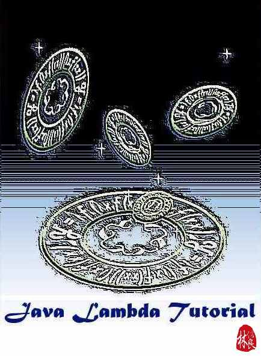

Java Lambda Tutorial
====================

你可以在 [Google Play](https://play.google.com/store/books/details?id=iwvMAgAAQBAJ) 或 [Pubu](http://www.pubu.com.tw/ebook/Java-Lambda-Tutorial-29189) 上取得 PDF 與 ePub 格式的電子書。

相對於 JavaScript、Python、Scala 等本身支援一級函式（First class function）的語言，Java 開發者對於一級函式是比較陌生的，因而在 2010 年 JCD 中的議程 [Lambda/Closure - 從 JavaScript、Python、Scala 到 Java SE 7](http://www.slideshare.net/JustinSDK/lambdaclosure-javascriptpythonscala-java-se-7 "Lambda/Closure - 從 JavaScript、Python、Scala 到 Java SE 7")，我簡單地從 JavaScript、Python、Scala 等語言的一級函式特性開始介紹，分享了 Java 要加入 Lambda/Closure 會有什麼樣的考量。

Java 的 Lambda 語法後來歷經了數次的討論與改變，後來確定在 Java SE 8 中引入 Lambda，也引進了因應新語法而帶來的 API 新功能，因而我在 2012 年 Java TWO 議程 [Java SE 8 的 Lambda 連鎖反應](http://www.slideshare.net/JustinSDK/java-se-8-lambda "Java SE 8 的 Lambda 連鎖反應") 中，從 Lambda 演算開始探討了 Lambda 的前世今生，以及會對 Java 帶來的新典範（Paradigm）與風格。

Java 引入的新典範其實有著函數式程式設計（Functional programming）的影子，想要善用 Java 引入的 Lambda 語法與新 API，先認識函數式程式設計會有非常大的幫助，因而在 2012 年 JCD 中，我於議程 [Java 開發者的函數式程式設計](http://www.slideshare.net/JustinSDK/java-16416534 "Java 開發者的函數式程式設計") 中探討了函數式程式設計，以及在 Java 中如何適當地運用函數式風格。

Java SE 8 確定於 2014 年 3 月發表，而我發現過去的這幾個議程可以整理成為系列文章，讓大家可以認識 Java 中 Lambda 的前世今生。除此之外，最後並加上了 JDK8 Functional API 的介紹，讓本書對 JDK8 Lambda 的介紹更為完整。

- 認識 Lambda/Closure
  - [從 JavaScript 的函式物件談起](https://openhome.cc/Gossip/CodeData/JavaLambdaTutorial/JavaScript.html)
  - [什麼是 Closure？](https://openhome.cc/Gossip/CodeData/JavaLambdaTutorial/Closure.html)
  - [Python 對 Lambda/Closure 的支援](https://openhome.cc/Gossip/CodeData/JavaLambdaTutorial/Python.html)
  - [從 Scala 中借鏡](https://openhome.cc/Gossip/CodeData/JavaLambdaTutorial/Scala.html)
  - [Java 的稻草人提案](https://openhome.cc/Gossip/CodeData/JavaLambdaTutorial/StrawMan.html)
  - [一級函式與 Lambda 演算](https://openhome.cc/Gossip/CodeData/JavaLambdaTutorial/LambdaCalculus.html)
  - [JDK8 Lambda 語法](https://openhome.cc/Gossip/CodeData/JavaLambdaTutorial/Java8Lambda.html)
  - [方法參考與建構式參考](https://openhome.cc/Gossip/CodeData/JavaLambdaTutorial/MethodReference.html)

- Java 開發者的函數式程式設計
  - [初探函數式程式設計](https://openhome.cc/Gossip/CodeData/JavaLambdaTutorial/FunctionalProgramming.html)
  - [代數資料型態](https://openhome.cc/Gossip/CodeData/JavaLambdaTutorial/AlgebraicDataType.html)
  - [List 處理模式](https://openhome.cc/Gossip/CodeData/JavaLambdaTutorial/ListPatterns.html)
  - [不可變特性](https://openhome.cc/Gossip/CodeData/JavaLambdaTutorial/Immutability.html)
  - [JDK8 預設方法](https://openhome.cc/Gossip/CodeData/JavaLambdaTutorial/Java8DefaultMethod.html)
  - [惰性](https://openhome.cc/Gossip/CodeData/JavaLambdaTutorial/Laziness.html)
  
- JDK8 Functional API
  - [使用 Optional 取代 null](https://openhome.cc/Gossip/Java/Optional.html)
  - [Consumer、Function、Predicate 與 Supplier](https://openhome.cc/Gossip/Java/ConsumerFunctionPredicateSupplier.html)
  - [使用 Stream 進行管線操作](https://openhome.cc/Gossip/Java/Stream.html)
  - [Stream 的 reduce 與 collect](https://openhome.cc/Gossip/Java/Reduction.html)
  - [Optional 與 Stream 的 flatMap](https://openhome.cc/Gossip/Java/FlatMap.html)
  - [Stream 與平行化](https://openhome.cc/Gossip/Java/ParallelStream.html)

